Developer Guide
===============

Database Design
---------------

In this project, the tables below the figure are implemented. Each team member has implemented four entities. In the following sections, detailed information about the tables, E-R diagrams and the owner member of the entitites can be found.

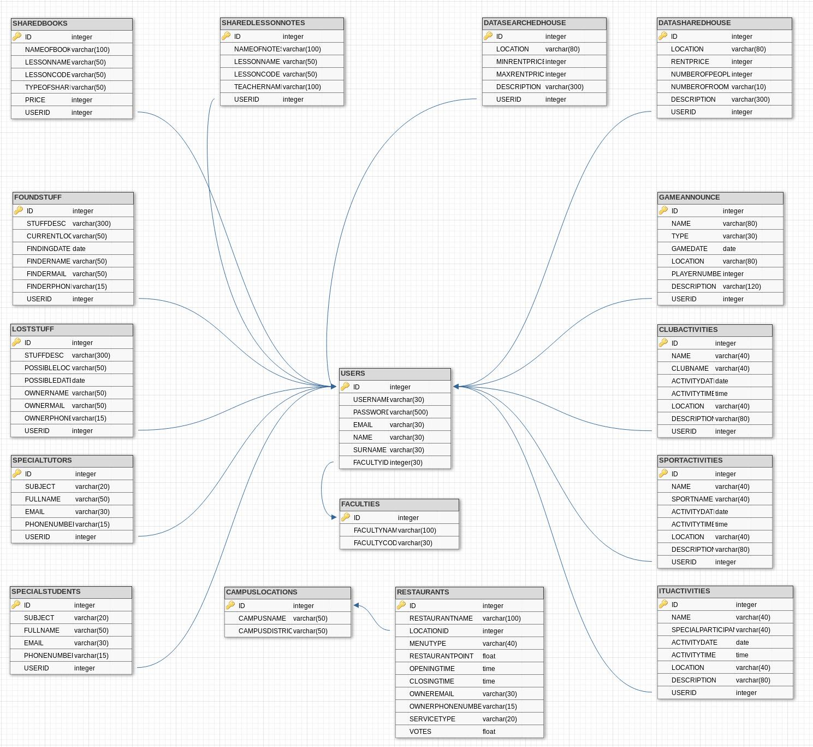

      General class diagram of the entities

Parts Implemented by Hakan Sander
^^^^^^^^^^^^^^^^^^^^^^^^^^^^^^^^^
Starting from this section, the tables which are implemented by Hakan Sander are placed and explained both by E-R diagrams and SQL queries.

The class diagram of the entities which are implemented by Hakan Sander can be seen below.

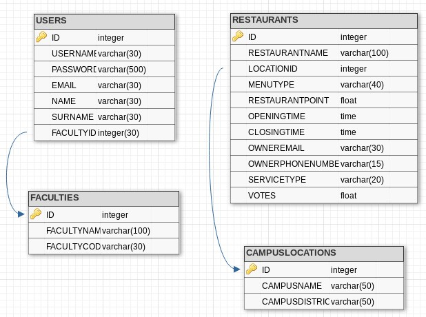

      Class diagram of the entities implemented by Hakan Sander

.. raw:: latex

    \newpage

The USERS table and its columns can be seen below.

.. code-block:: sql

    CREATE TABLE USERS (
        ID SERIAL PRIMARY KEY NOT NULL,
        USERNAME VARCHAR(30) NOT NULL,
        PASSWORD VARCHAR(500) NOT NULL,
        EMAIL VARCHAR(30) NOT NULL,
        NAME VARCHAR(30) NOT NULL,
        SURNAME VARCHAR(30) NOT NULL,
        FACULTYID INTEGER REFERENCES FACULTIES(ID) ON DELETE CASCADE
    );

In the program, ID, USERNAME and EMAIL should be unique. However, since the SERIAL is used, the uniqueness of the USERS.ID is guaranteed. For the EMAIL and the USERNAME, the validation and the validation errors is written in the program. Therefore, their uniqueness is also guaranteed.

The E-R diagram of the USERS table can be seen below.

.. figure:: diagrams/hakan/user.png
      :scale: 100 %
      :alt: sharing house's E/R diagram

      USERS table E-R diagram

.. raw:: latex

    \newpage

FACULTY information is stored in a different table since the FACULTY information might be needed from not only USERS table but also different tables in the program. The FACULTIES table and its columns can be seen below.

.. code-block:: sql

    CREATE TABLE FACULTIES (
        ID SERIAL PRIMARY KEY NOT NULL,
        FACULTYNAME VARCHAR(100) NOT NULL,
        FACULTYCODE VARCHAR(30) NOT NULL
    );

The USERS table references the ID column in the FACULTIES table. During the implementation of the registering a new user and updating his/her faculty foreign key is needed to be used. In addition, during the deletion of a faculty due to that FACULTIES table is referenced by the USERS table, USERS table should also be updated. Therefore, ON DELETE CASCADE is used in the following way in the USERS table.

.. code-block:: sql

    FACULTYID INTEGER REFERENCES FACULTIES(ID) ON DELETE CASCADE

SERIAL is used for the primary keys of the tables. SERIAL initializes itself to 1 and automatically increments itself when a new data is added into the table. Thas is a very useful property of POSTQRESQL.

During the initialization of the database, following faculties are added into the FACULTIES table by the following queries. These faculties are the most recent faculties of the ITU.

.. code-block:: sql

    INSERT INTO FACULTIES(FACULTYNAME, FACULTYCODE) VALUES ('Faculty of Civil Engineering', 'IN');
    INSERT INTO FACULTIES(FACULTYNAME, FACULTYCODE) VALUES ('Faculty of Architecture', 'MM');
    INSERT INTO FACULTIES(FACULTYNAME, FACULTYCODE) VALUES ('Faculty of Mechanical Engineering', 'MK');
    INSERT INTO FACULTIES(FACULTYNAME, FACULTYCODE) VALUES ('Faculty of Electrical and Electronics Engineering', 'EE');
    INSERT INTO FACULTIES(FACULTYNAME, FACULTYCODE) VALUES ('Faculty of Mines', 'MD');
    INSERT INTO FACULTIES(FACULTYNAME, FACULTYCODE) VALUES ('Faculty of Chemical and Metallurgical Engineering', 'KM');
    INSERT INTO FACULTIES(FACULTYNAME, FACULTYCODE) VALUES ('Faculty of Management', 'IS');
    INSERT INTO FACULTIES(FACULTYNAME, FACULTYCODE) VALUES ('Faculty of Naval Architecture and Ocean Engineering', 'GD');
    INSERT INTO FACULTIES(FACULTYNAME, FACULTYCODE) VALUES ('Faculty of Science and Letters', 'FE');
    INSERT INTO FACULTIES(FACULTYNAME, FACULTYCODE) VALUES ('Faculty of Aeronautics and Astronautics', 'UU');
    INSERT INTO FACULTIES(FACULTYNAME, FACULTYCODE) VALUES ('Turkish Music State Conservatory', 'KO');
    INSERT INTO FACULTIES(FACULTYNAME, FACULTYCODE) VALUES ('Maritime Faculty', 'DZ');
    INSERT INTO FACULTIES(FACULTYNAME, FACULTYCODE) VALUES ('Faculty of Textile Technologies and Design', 'TK');
    INSERT INTO FACULTIES(FACULTYNAME, FACULTYCODE) VALUES ('Faculty of Computer and Informatics Engineering', 'BB');

The E-R diagram of the FACULTIES table can be seen below.

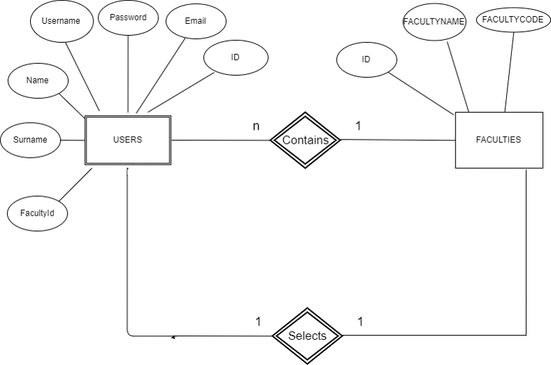

      FACULTIES table E-R diagram

.. raw:: latex

    \newpage

In the RESTAURANTS table, current restaurants throughout the ITU campuses is stored and shown to the users. Users are able to vote the RESTAURANTS. The RESTAURANTS table is given below.

.. code-block:: sql

    CREATE TABLE RESTAURANTS (
        ID SERIAL PRIMARY KEY NOT NULL,
        RESTAURANTNAME VARCHAR(100) NOT NULL,
        LOCATIONID INTEGER REFERENCES CAMPUSLOCATIONS(ID) ON DELETE CASCADE NOT NULL,
        MENUTYPE VARCHAR(40) NOT NULL,
        RESTAURANTPOINT FLOAT DEFAULT -1 NOT NULL,
        OPENINGTIME TIME  NOT NULL,
        CLOSINGTIME TIME NOT NULL,
        OWNEREMAIL VARCHAR(30) NOT NULL,
        OWNERPHONENUMBER VARCHAR(15) NOT NULL,
        SERVICETYPE VARCHAR(20) NOT NULL,
        VOTES FLOAT DEFAULT 0
    );

Default vote is set as "0" since initially there is not any votes when the restaurant is created by the admin. RESTAURANTPOINT is also set as "-1" to indicate that "There is not any votes yet" initially.

The RESTAURANT table references to CAMPUSLOCATIONS table. The CAMPUSLOCATIONS is stored in a different table since the data might be needed from different places in the program and different tables in the program.

"ON DELETE CASCADE" is used for the LOCATIONID since when a CAMPUSLOCATION which is referenced by RESTAURANTS table is deleted, the data that contains that CAMPUSLOCATION should also be deleted.

The E-R diagram of the RESTAURANTS table can be seen below.

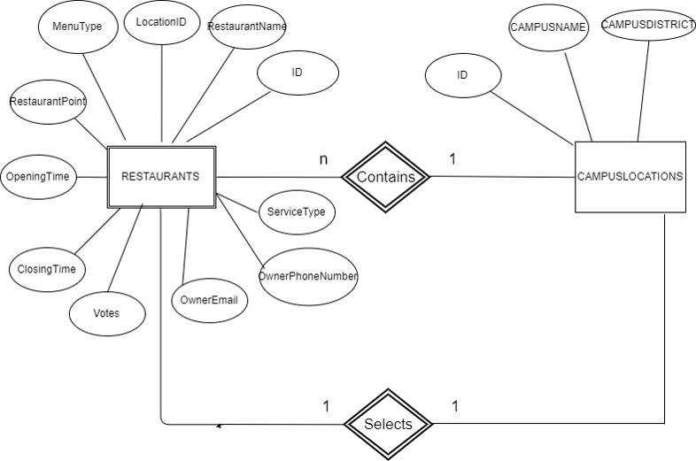

      RESTAURANTS table E-R diagram

.. raw:: latex

    \newpage

In the CAMPUSLOCATIONS table, the campuses of the ITU is stored according to their districts.

.. code-block:: sql

    CREATE TABLE CAMPUSLOCATIONS (
        ID SERIAL PRIMARY KEY NOT NULL,
        CAMPUSNAME  VARCHAR(50) NOT NULL,
        CAMPUSDISTRICT VARCHAR(50) NOT NULL
    );

The current campus locations of the ITU is added below. Since there are some Turkish Characters, we needed to write down some characters specifically. Otherwise, the program gives error.

.. code-block:: sql

    INSERT INTO CAMPUSLOCATIONS(CAMPUSNAME, CAMPUSDISTRICT) VALUES ('Ayaza' || U&'\011F' || 'a', 'Maslak');
    INSERT INTO CAMPUSLOCATIONS(CAMPUSNAME, CAMPUSDISTRICT) VALUES ('Ma' || U&'\00E7' || 'ka', 'Taksim');
    INSERT INTO CAMPUSLOCATIONS(CAMPUSNAME, CAMPUSDISTRICT) VALUES ('Ta' || U&'\015F' || 'k' || U&'\0131' || U&'\015F' || 'la', 'Taksim');
    INSERT INTO CAMPUSLOCATIONS(CAMPUSNAME, CAMPUSDISTRICT) VALUES ('Tuzla', 'Tuzla');

.. raw:: latex

    \newpage

Parts Implemented by Görkem Toppeker
^^^^^^^^^^^^^^^^^^^^^^^^^^^^^^^^^^^^

Starting from this section, the tables which are implemented by Görkem Toppeker are placed and explained both by E-R diagrams and SQL queries.

.. figure:: tables/gorkem.jpg
      :scale: 100 %
      :alt: gorkem entity class diagram

      Class diagram of the entities implemented by Görkem Toppeker

.. code-block:: sql

    CREATE TABLE GAMEANNOUNCE(
        ID SERIAL PRIMARY KEY,
        NAME VARCHAR(80) NOT NULL,
        TYPE VARCHAR(30) NOT NULL,
        GAMEDATE DATE NOT NULL,
        LOCATION VARCHAR(80) NOT NULL,
        PLAYERNUMBER INTEGER NOT NULL,
        DESCRIPTION VARCHAR(120) NOT NULL,
        USERID INTEGER REFERENCES USERS(ID) ON DELETE CASCADE
    );

.. code-block:: sql

    INSERT INTO GAMEANNOUNCE (NAME, TYPE, GAMEDATE, LOCATION, PLAYERNUMBER, DESCRIPTION, USERID) VALUES('FIFA 18', 'Video Game', '2017-12-4', 'Levent', 4, 'Come with your couple', 1);
    INSERT INTO GAMEANNOUNCE (NAME, TYPE, GAMEDATE, LOCATION, PLAYERNUMBER, DESCRIPTION, USERID) VALUES('UNO', 'Table Game', '2017-12-1', 'EEB Kantini', 6, 'Come and have fun with us', 1);
    INSERT INTO GAMEANNOUNCE (NAME, TYPE, GAMEDATE, LOCATION, PLAYERNUMBER, DESCRIPTION, USERID) VALUES('Hal' || U&'\0131' || 'saha Futbol Ma' || U&'\00E7' || U&'\0131', 'Sport Game', '2017-12-2', 'Ayaza' || U&'\011F' || 'a Hal' || U&'\0131' || 'saha', 12, 'Special talents are not required', 1);

.. code-block:: sql

    CREATE TABLE CLUBACTIVITIES (
        ID SERIAL PRIMARY KEY NOT NULL,
        NAME VARCHAR(40) NOT NULL,
        CLUBNAME VARCHAR(40) NOT NULL,
        ACTIVITYDATE DATE NOT NULL,
        ACTIVITYTIME TIME NOT NULL,
        LOCATION VARCHAR(40) NOT NULL,
        DESCRIPTION VARCHAR(80) NOT NULL,
        USERID INTEGER REFERENCES USERS(ID) ON DELETE CASCADE
    );

.. code-block:: sql

    INSERT INTO CLUBACTIVITIES (NAME, CLUBNAME, ACTIVITYDATE, ACTIVITYTIME, LOCATION, DESCRIPTION, USERID) VALUES('Scheduled Meeting', 'IEEE Computer Society', '2017-12-4', '17:00:00', 'EEB 1302', 'Some important topics will be discussed', 1);
    INSERT INTO CLUBACTIVITIES (NAME, CLUBNAME, ACTIVITYDATE, ACTIVITYTIME, LOCATION, DESCRIPTION, USERID) VALUES('Python Training', 'Free Software Club', '2018-1-10', '18:30:00', 'EEB 4401', 'Python Training 1st lesson', 1);
    INSERT INTO CLUBACTIVITIES (NAME, CLUBNAME, ACTIVITYDATE, ACTIVITYTIME, LOCATION, DESCRIPTION, USERID) VALUES('Comedy Film Watching', 'Cinema Club', '2017-12-4', '20:00:00', 'MED', 'A comedy film will be choosed and watched', 1);

.. code-block:: sql

    CREATE TABLE SPORTACTIVITIES (
        ID SERIAL PRIMARY KEY NOT NULL,
        NAME VARCHAR(40) NOT NULL,
        SPORTNAME VARCHAR(40) NOT NULL,
        ACTIVITYDATE DATE NOT NULL,
        ACTIVITYTIME TIME NOT NULL,
        LOCATION VARCHAR(40) NOT NULL,
        DESCRIPTION VARCHAR(80) NOT NULL,
        USERID INTEGER REFERENCES USERS(ID) ON DELETE CASCADE
    );

.. code-block:: sql

    INSERT INTO SPORTACTIVITIES (NAME, SPORTNAME, ACTIVITYDATE, ACTIVITYTIME, LOCATION, DESCRIPTION, USERID) VALUES('Fenerbahce-Galatasaray Derby', 'Football', '2018-4-12', '19:30:00', 'Ulker Stadyumu', 'Passolig card is required', 1);
    INSERT INTO SPORTACTIVITIES (NAME, SPORTNAME, ACTIVITYDATE, ACTIVITYTIME, LOCATION, DESCRIPTION, USERID) VALUES('Besiktas Champions League Match', 'Football', '2018-2-1', '21:45:00', 'Vodafone Arena', 'Quarter Final Match', 1);
    INSERT INTO SPORTACTIVITIES (NAME, SPORTNAME, ACTIVITYDATE, ACTIVITYTIME, LOCATION, DESCRIPTION, USERID) VALUES('Fenerbahce Final Four Match', 'Basketball', '2018-5-9', '19:30:00', 'Belgrad', 'Olympiacos, Real Madrid, Fenerbahce or CSKA', 1);

.. code-block:: sql

    CREATE TABLE ITUACTIVITIES (
        ID SERIAL PRIMARY KEY NOT NULL,
        NAME VARCHAR(40) NOT NULL,
        SPECIALPARTICIPANT VARCHAR(40) NOT NULL,
        ACTIVITYDATE DATE NOT NULL,
        ACTIVITYTIME TIME NOT NULL,
        LOCATION VARCHAR(40) NOT NULL,
        DESCRIPTION VARCHAR(80) NOT NULL,
        USERID INTEGER REFERENCES USERS(ID) ON DELETE CASCADE
    );

.. code-block:: sql

    INSERT INTO ITUACTIVITIES (NAME, SPECIALPARTICIPANT, ACTIVITYDATE, ACTIVITYTIME, LOCATION, DESCRIPTION, USERID) VALUES('Mustafa Inan Anma Toplantisi', 'Rektor', '2017-12-8', '14:30:00', 'SDKM Salonu', 'Etkinlik 2 saattir', 1);
    INSERT INTO ITUACTIVITIES (NAME, SPECIALPARTICIPANT, ACTIVITYDATE, ACTIVITYTIME, LOCATION, DESCRIPTION, USERID) VALUES('Toyota HYBRID Kampuste', 'Oguzhan Orhan', '2017-12-6', '17:00:00', 'Otomotiv Lab', 'Etkinlige herkes davetlidir', 1);
    INSERT INTO ITUACTIVITIES (NAME, SPECIALPARTICIPANT, ACTIVITYDATE, ACTIVITYTIME, LOCATION, DESCRIPTION, USERID) VALUES('MIAM Music and Expression Seminars', 'Golo Follmer', '2017-12-7', '17:30:00', 'Macka Campus', 'All the students are welcomed', 1);

.. raw:: latex

    \newpage

Parts Implemented by Adil Furkan Ekici
^^^^^^^^^^^^^^^^^^^^^^^^^^^^^^^^^^^^^^

Starting from this section, the tables which are implemented by Adil Furkan Ekici are placed and explained both by E-R diagrams and SQL queries.

The class diagram of the entities which is implemented by Adil Furkan Ekici can be seen below.

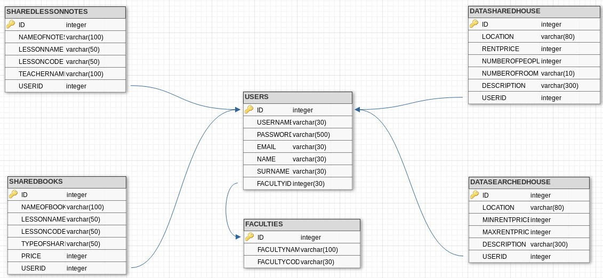

      SHARINGHOUSE table E-R diagram

.. raw:: latex

    \newpage

DATASHAREDHOUSE table holds informations for sharing house announcement such as these location, rentprice, number of people in house currently, number of room and description.In addition this table announcement id and owner of announcement id

You can see all colums of the DATASHAREDHOUSE table and their types in the table create code below.

.. code-block:: sql

    CREATE TABLE DATASHAREDHOUSE(
        ID SERIAL PRIMARY KEY NOT NULL,
        LOCATION VARCHAR(80) NOT NULL,
        RENTPRICE INTEGER NOT NULL,
        NUMBEROFPEOPLE INTEGER NOT NULL,
        NUMBEROFROOM VARCHAR (10) NOT NULL,
        DESCRIPTION VARCHAR (300) NOT NULL,
        USERID INTEGER REFERENCES USERS(ID) ON DELETE CASCADE
    );

There is also an E/R diagram for DATASHAREDHOUSE table.

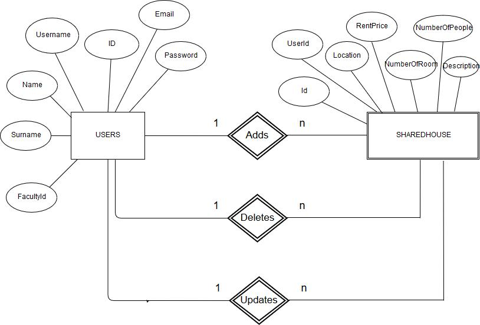

      SHAREDHOUSE table E-R diagram

DATASEARCHEDHOUSE table holds informations for searching house announcement such as these location, maximum rent price, minimum rent price, and description.In addition this table announcement id and owner of announcement id

You can see all colums of the DATASEARCHEDHOUSE table and their types in the table create code below.

.. code-block:: sql

    CREATE TABLE DATASEARCHEDHOUSE(
        ID SERIAL PRIMARY KEY NOT NULL,
        LOCATION VARCHAR(80) NOT NULL,
        MINRENTPRICE INTEGER NOT NULL,
        MAXRENTPRICE INTEGER NOT NULL,
        DESCRIPTION VARCHAR (300) NOT NULL,
        USERID INTEGER REFERENCES USERS(ID) ON DELETE CASCADE
    );

There is also an E/R diagram for DATASEARCHEDHOUSE table.

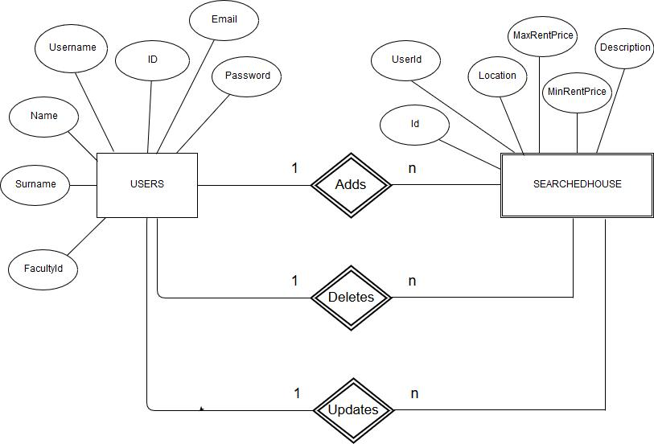

      DATASEARCHEDHOUSE table E-R diagram

SHAREDBOOKS table holds informations for shared books announcement such as these name of book, lesson name, lesson code, type of share,price and description.In addition this table announcement id and owner of announcement id

You can see all colums of the SHAREDBOOKS table and their types in the table create code below.

.. code-block:: sql

    CREATE TABLE SHAREDBOOKS(
        ID SERIAL PRIMARY KEY NOT NULL ,
        NAMEOFBOOK VARCHAR(100) NOT NULL ,
        LESSONNAME VARCHAR(50) NOT NULL ,
        LESSONCODE VARCHAR(50) NOT NULL ,
        TYPEOFSHARE VARCHAR(80) NOT NULL ,
        PRICE INTEGER,
        USERID INTEGER REFERENCES USERS(ID) ON DELETE CASCADE
    );

There is also an E/R diagram for SHAREDBOOKS table.

      SHAREDBOOKS table E-R diagram

SHAREDLESSONNOTES table holds informations for shared lesson notes announcement such as these name of note, lesson name, lesson code, and teacher name.In addition this table announcement id and owner of announcement id

You can see all colums of the SHAREDLESSONNOTES table and their types in the table create code below.

.. code-block:: sql

  CREATE TABLE SHAREDLESSONNOTES(
      ID SERIAL PRIMARY KEY NOT NULL,
      NAMEOFNOTES VARCHAR(100) NOT NULL,
      LESSONNAME VARCHAR(50) NOT NULL ,
      LESSONCODE VARCHAR(50) NOT NULL ,
      TEACHERNAME VARCHAR(100) NOT NULL ,
      USERID INTEGER REFERENCES USERS(ID) ON DELETE CASCADE
  );

There is also an E/R diagram for SHAREDLESSONNOTES table.

      SHAREDLESSONNOTES table E-R diagram

.. raw:: latex

    \newpage

Parts Implemented by Sercan Şahan
^^^^^^^^^^^^^^^^^^^^^^^^^^^^^^^^^

Starting from this section, the tables which are implemented by Sercan Şahan are placed and explained both by E-R diagrams and SQL queries.

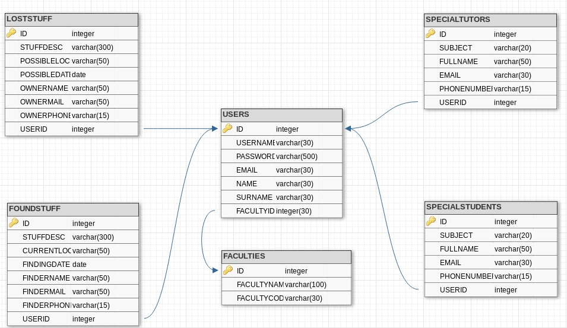

      Class diagram of the entities implemented by Sercan Şahan

.. raw:: latex

    \newpage

.. code-block:: sql

    CREATE TABLE SPECIALTUTORS (
        ID SERIAL PRIMARY KEY NOT NULL,
        SUBJECT VARCHAR(20) NOT NULL,
        FULLNAME VARCHAR(50) NOT NULL,
        EMAIL VARCHAR(30) NOT NULL,
        PHONENUMBER VARCHAR(15) NOT NULL,
        USERID INTEGER REFERENCES USERS(ID) ON DELETE CASCADE
    );

The E-R diagram of the SPECIALTUTORS table can be seen below.

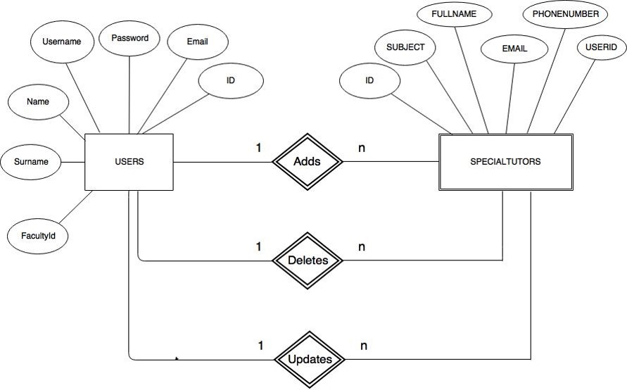

      SPECIALTUTORS table E-R diagram

This table keeps information of Special Tutors. ID is unique to distinguish different items. USERID is a foreign key and keeps information of who entered this information to table.

.. raw:: latex

    \newpage

.. code-block:: sql

    CREATE TABLE SPECIALSTUDENTS (
        ID SERIAL PRIMARY KEY NOT NULL,
        SUBJECT VARCHAR(20) NOT NULL,
        FULLNAME VARCHAR(50) NOT NULL,
        EMAIL VARCHAR(30) NOT NULL,
        PHONENUMBER VARCHAR(15) NOT NULL,
        USERID INTEGER REFERENCES USERS(ID) ON DELETE CASCADE
    );

The E-R diagram of the SPECIALSTUDENTS table can be seen below.

      SPECIALSTUDENTS table E-R diagram

This table keeps information of Special Students. ID is unique to distinguish different items. USERID is a foreign key and keeps information of who entered this information to table.

.. raw:: latex

    \newpage

.. code-block:: sql

    CREATE TABLE LOSTSTUFF (
        ID SERIAL PRIMARY KEY NOT NULL,
        STUFFDESC VARCHAR(300) NOT NULL,
        POSSIBLELOC VARCHAR(50) NOT NULL,
        POSSIBLEDATE DATE NOT NULL,
        OWNERNAME VARCHAR(50) NOT NULL,
        OWNERMAIL VARCHAR(50) NOT NULL,
        OWNERPHONE VARCHAR(15) NOT NULL,
        USERID INTEGER REFERENCES USERS(ID) ON DELETE CASCADE
    );

The E-R diagram of the LOSTSTUFF table can be seen below.

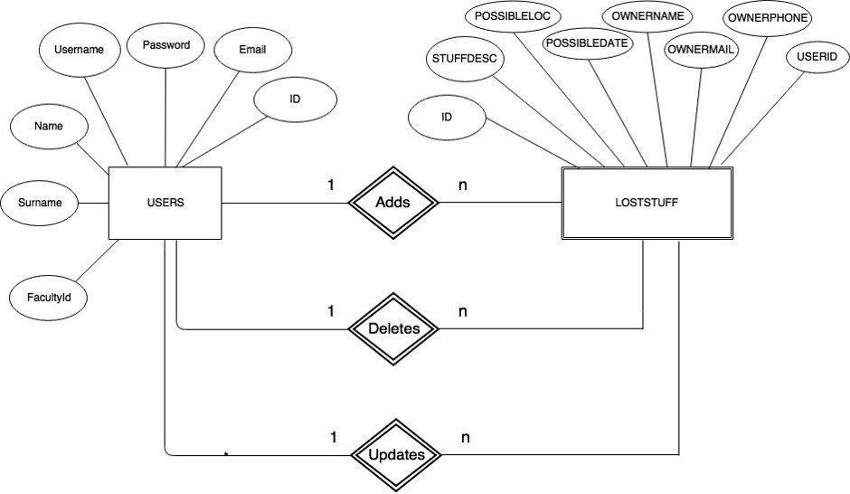

      LOSTSTUFF table E-R diagram

This table keeps information of Lost Stuff. ID is unique to distinguish different items. USERID is a foreign key and keeps information of who entered this information to table.

.. raw:: latex

    \newpage

.. code-block:: sql

    CREATE TABLE FOUNDSTUFF (
        ID SERIAL PRIMARY KEY NOT NULL,
        STUFFDESC VARCHAR(300) NOT NULL,
        CURRENTLOC VARCHAR(50) NOT NULL,
        FINDINGDATE DATE NOT NULL,
        FOUNDERNAME VARCHAR(50) NOT NULL,
        FOUNDERMAIL VARCHAR(50) NOT NULL,
        FOUNDERPHONE VARCHAR(15) NOT NULL,
        USERID INTEGER REFERENCES USERS(ID) ON DELETE CASCADE
    );

The E-R diagram of the FOUNDSTUFF table can be seen below.

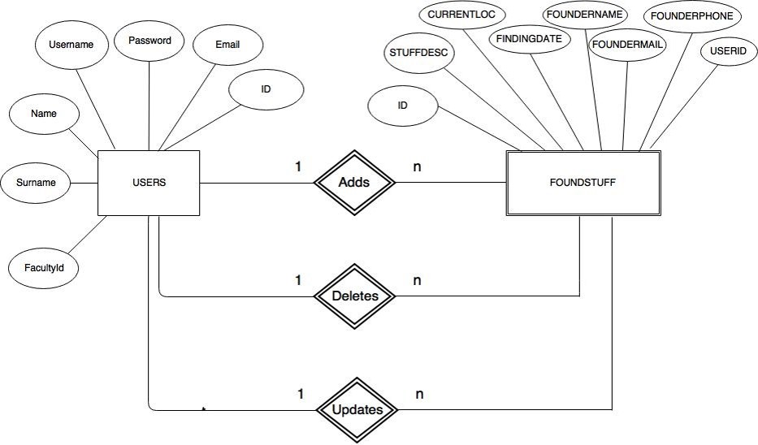

      FOUNDSTUFF table E-R diagram

This table keeps information of Found Stuff. ID is unique to distinguish different items. USERID is a foreign key and keeps information of who entered this information to table.

.. raw:: latex

    \newpage

Code
----

.. toctree::

   member1
   member2
   member3
   member4
