Parts Implemented by Hakan Sander
=================================
Registration, login, profile, restaurants, faculties pages and user operations are created by Hakan Sander. Restaurants page targets the users that desire to obtain information about the restaurants of all the ITU campuses.

.. raw:: latex

    \newpage

User Types
------------

There are two types of users in the project which are the admin and the standard user. Only standard users can be created using the registration page. The admin is created during the initialization of the project. Admin user has access to initialize database, list users, add faculty and add restaurant pages in addition to the pages that can be accessed by the standard users.

Registration
------------
In the registration page, people can register a new standard user account by filling the necessary areas.

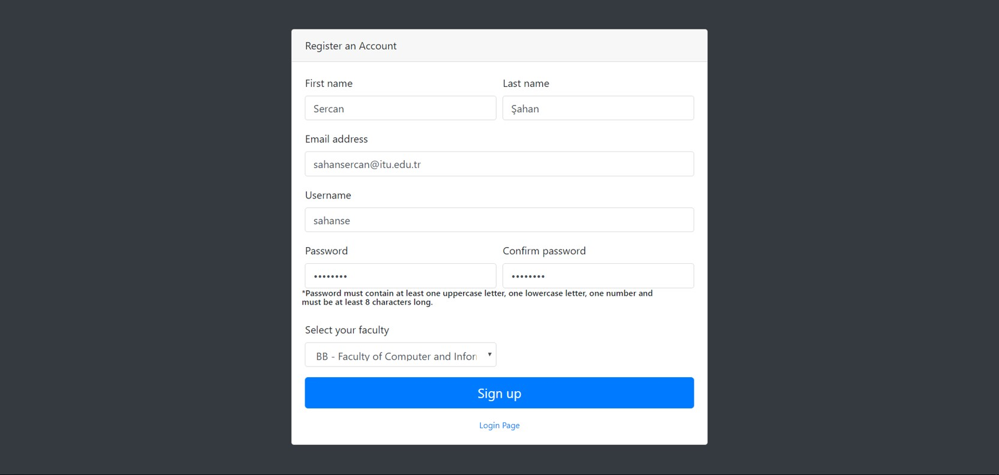

      Registration page

Users can select their faculties using the drop-down list.

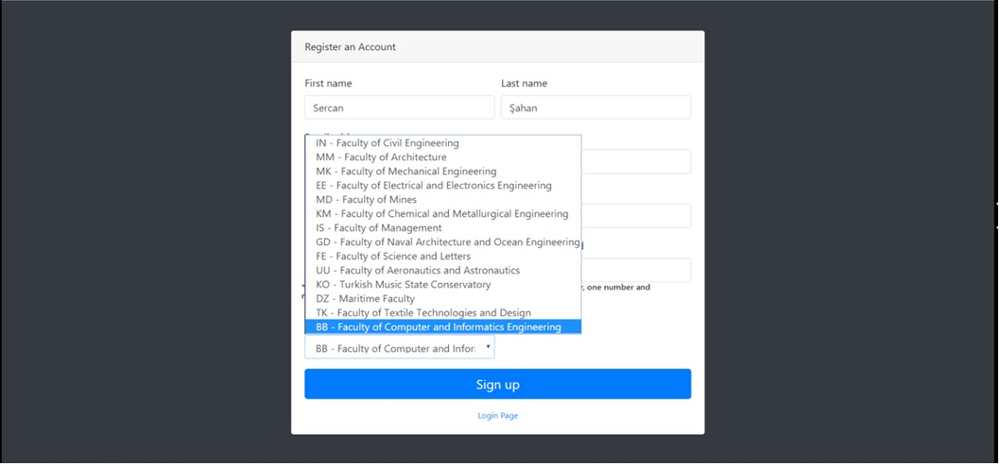

      Drop-down list of faculties

.. raw:: latex

    \newpage

All the areas should be filled during the registration and the password should include at least one lowercase letter, one uppercase letter and must be at least eight characters long. Otherwise, the site gives an error message about the condition that is not satisfied.

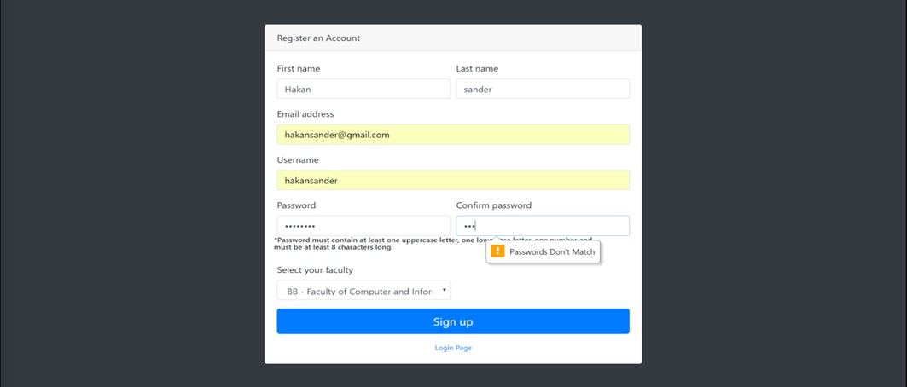

      Registration page

Username and email should be unique. Otherwise, the site will give error messages. Since the username already exists, the site gives an error message.

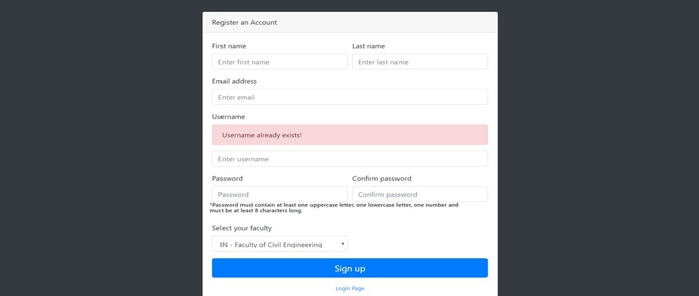

      Username error

.. raw:: latex

    \newpage

The site also gives an error message for the email.

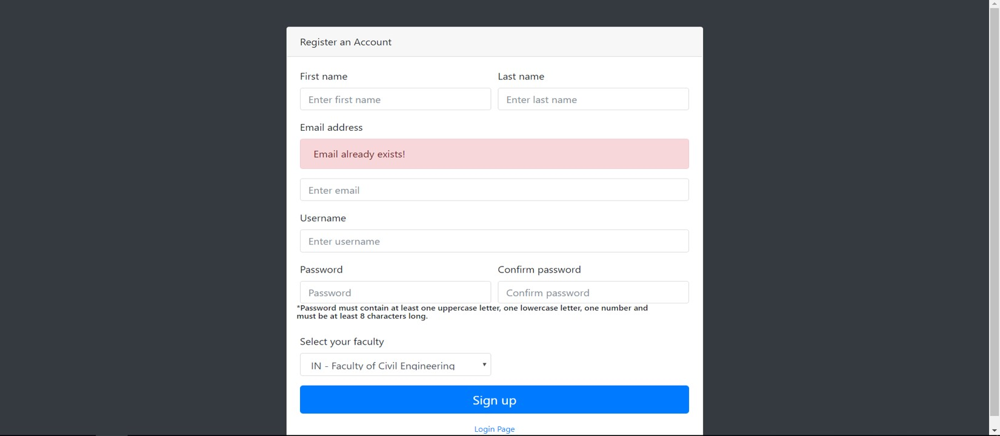

      Email error

Login
------------

After the account creation is succesfully completed, the user is redirected to login page. From the login page, both the admins and standard users are able to login to the website. In the picture below, the site is entered as the admin.

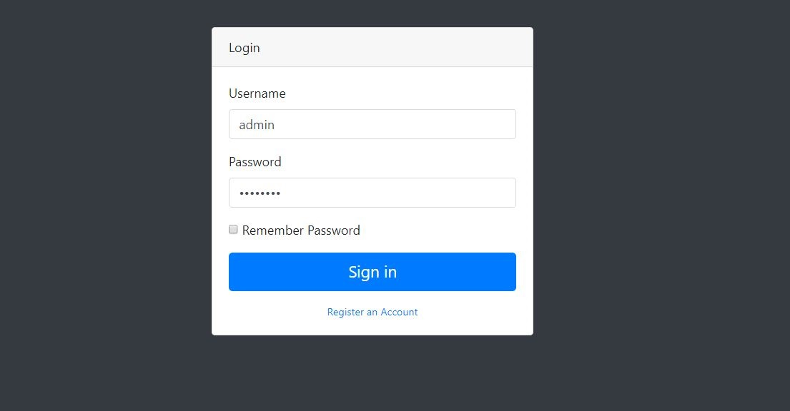

      Login page

.. raw:: latex

    \newpage

List Users
------------

After the user is succesfully logged in as admin, he/she is redirected to the homepage. Then, when the user clicks the list user button on the navigation bar, all the registered users are listed.

.. figure:: images/hakan/listUsers.png
      :scale: 100 %
      :alt: list users

      User list

Profile
------------

The admin is able to select a user profile by clicking the profile button. Then, the admin can delete the selected user's profile.

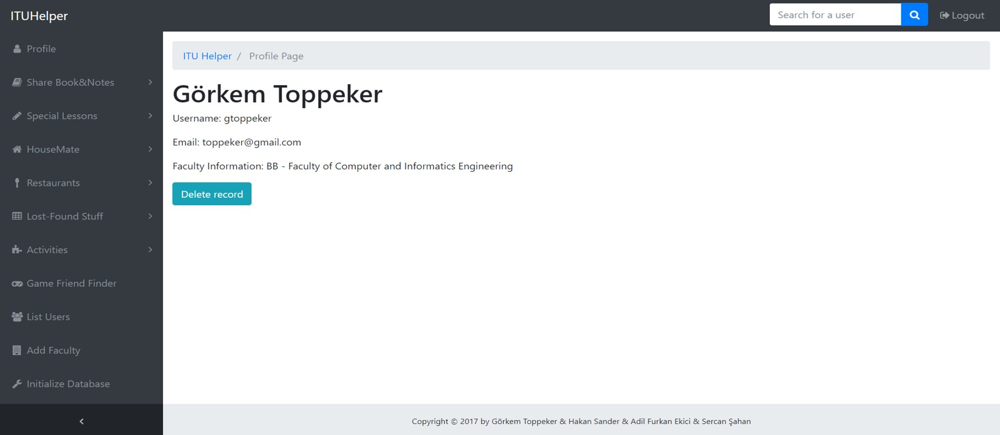

      Profile deletion by the admin

.. raw:: latex

    \newpage

The admin can only update his profile. However, normal users can both update and delete their profiles.

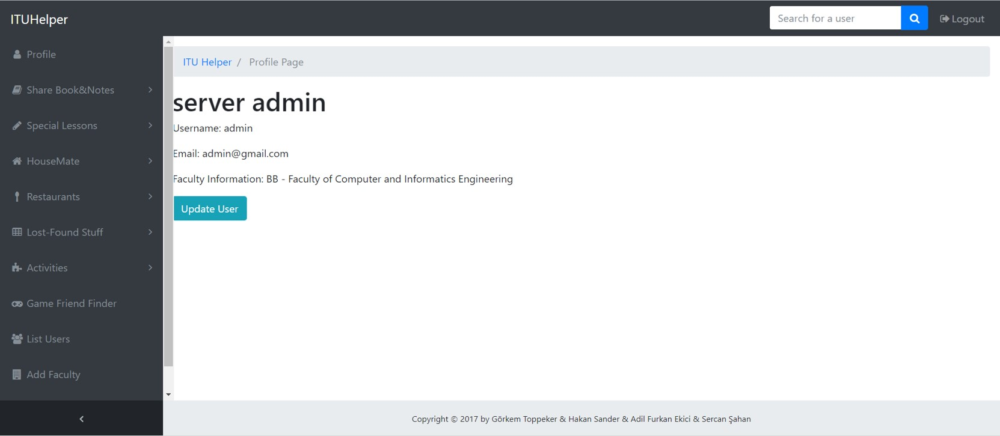

      Profile page of the admin

User Search
------------

Users are able to search the other users by the search bar on the layout. In the picture below, the users whose usernames start with "a" are searched using the search bar.

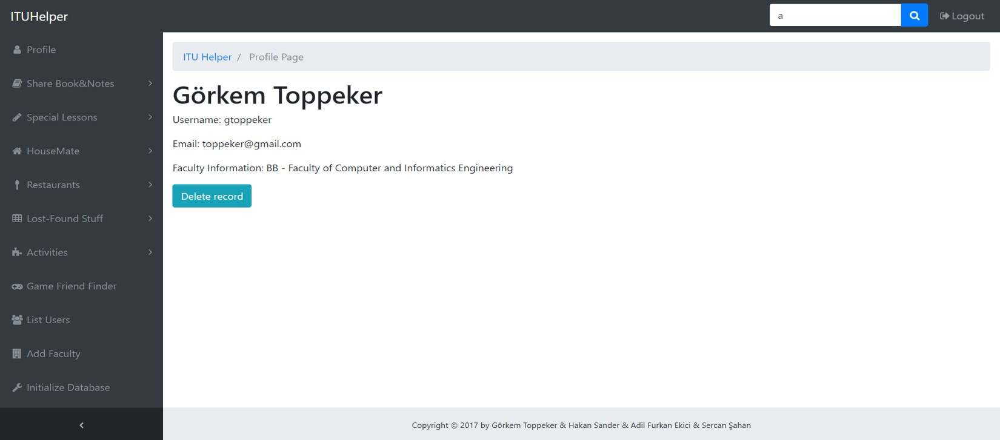

      Search bar sample search

.. raw:: latex

    \newpage

The users whose usernames start with "a" are listed in the figure below.

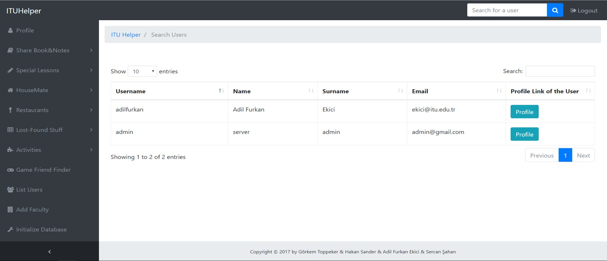

      Search bar sample search results

The bar can be used for any combination of symbols and it can be accessed from all the pages. In the figure below, the users whose usernames start with "adm" are searched.

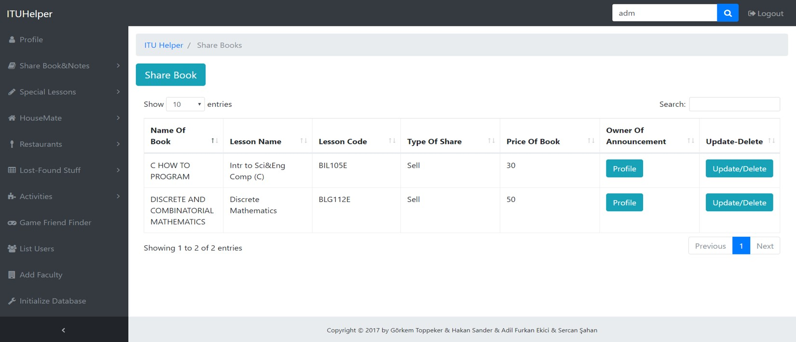

      Search bar sample search

.. raw:: latex

    \newpage

Due to that only the user admin has the combination "adm" in the beginning of his/her username, only the admin is listed.

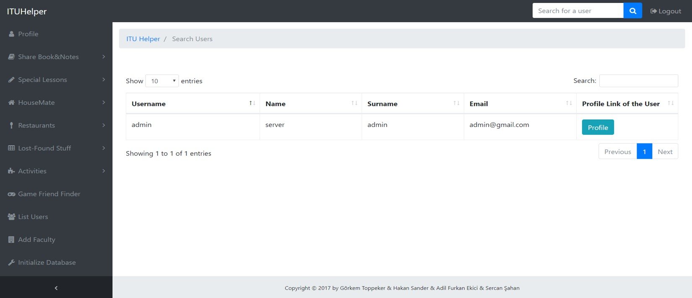

      Search bar sample search result

Faculties
------------

The admin can add a new faculty by clicking the add faculty button on the navigation bar. When the admin fills the necessary information and clicks to the send button a new faculty is created.

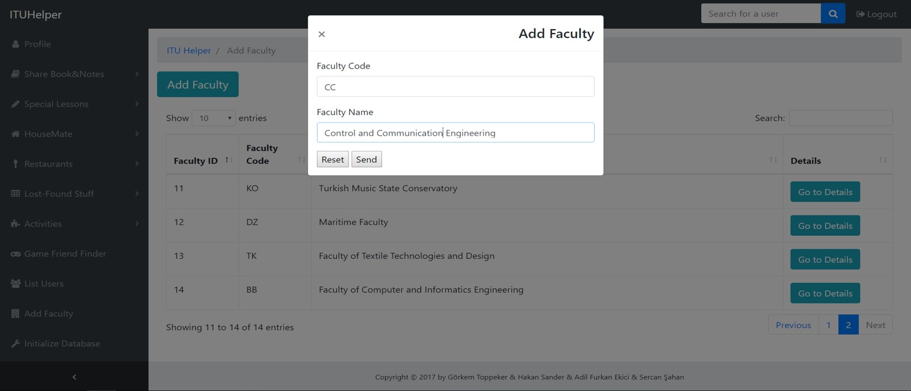

      Faculty addition by the admin

.. raw:: latex

    \newpage

The new faculty Control and Communication Engineering can be seen on the figure below after the addition is succesfully completed.

      Faculty addition by the admin

The admin can update and delete the selected faculty's information by clicking the go to details button.

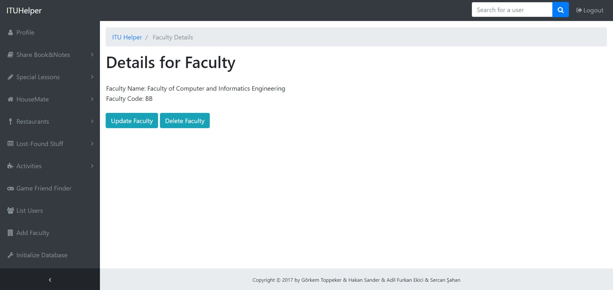

      Faculty details page

.. raw:: latex

    \newpage

Restaurants
------------

The admin can add a new restaurant by clicking the add restaurant button. Previously added restaurants are both listed to the users and to the admin.

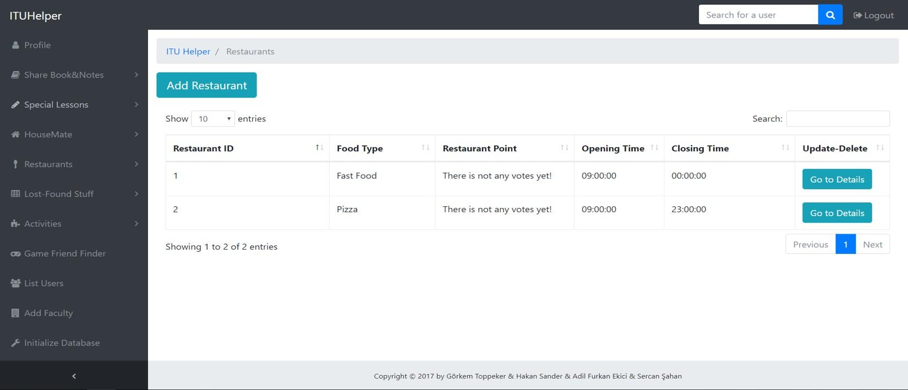

      Restaurant addition and restaurant list

A sample new restaurant "Selvi" is added in the figure by the admin.

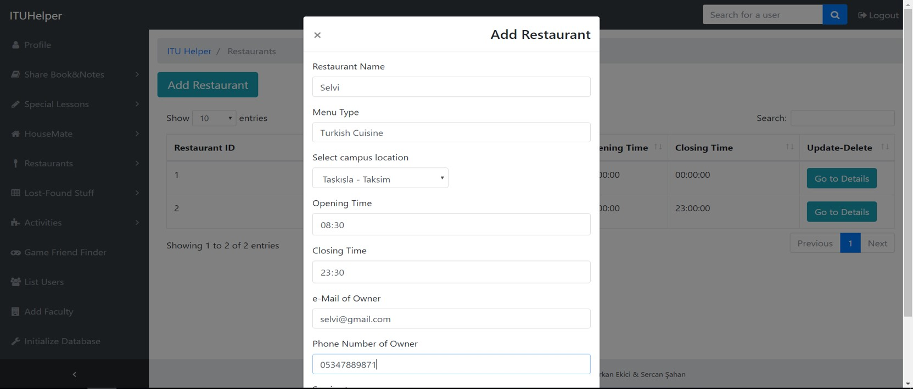

      Example restaurant addition

.. raw:: latex

    \newpage

The "Selvi Restaurant" is added and listed on the same page. However, there is not any votes for the restaurant yet.

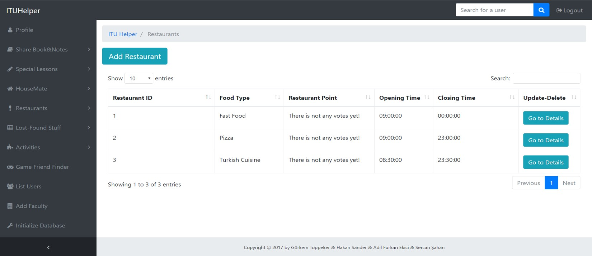

      Restaurant addition result

Both type of users can reach the details of the restaurant by clicking the go to details button. After clicking it, only the admins can delete or update the restaurant information. Both the admin and the users can vote for the restaurants.

.. figure:: images/hakan/restaurantDetails.jpg
      :scale: 100 %
      :alt: restaurant details

      Restaurant details page

.. raw:: latex

    \newpage

A sample vote is given for the Selvi Restaurant on the figure.

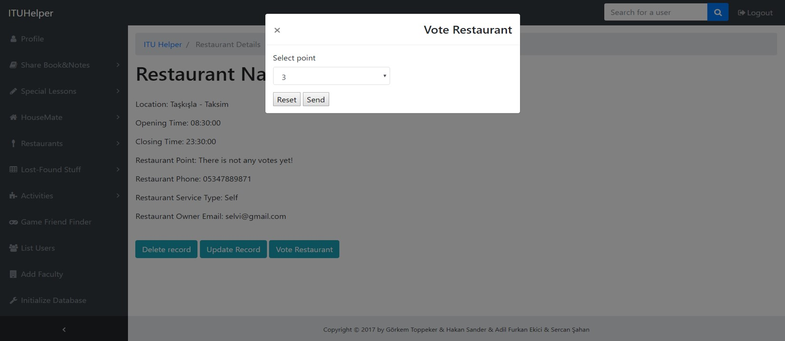

      Restaurant vote

After voting the restaurant, the restaurant point is changed from "There is not any votes yet" to the given point.

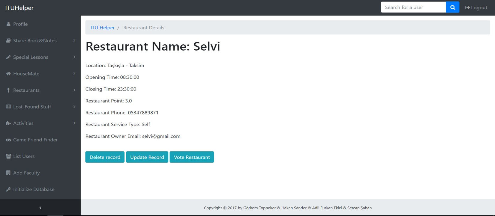

      Restaurant vote result

.. raw:: latex

    \newpage

Relative Links
--------------

Relative links are unique. When a non-existant link is written, the user is redirected to the homepage. The relative link "/profile/admin" can be seen on the figure below.

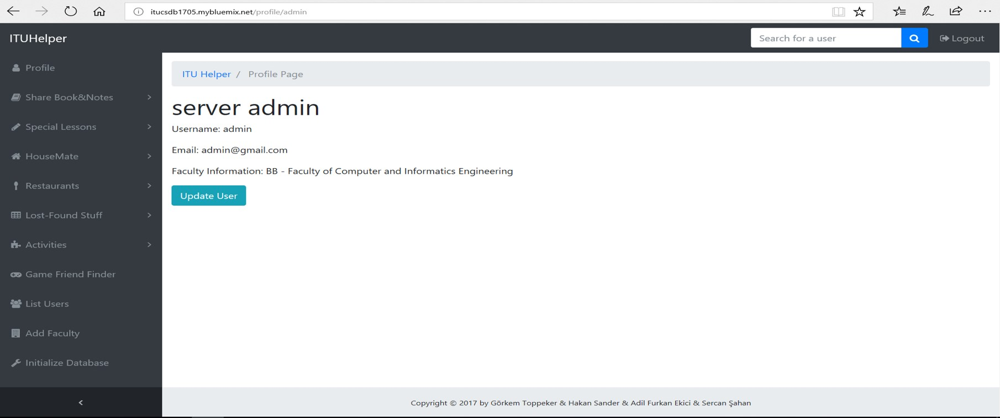

      Relative link of the admin

Unauthorized Access
-------------------

If the standard users tries to reach the pages that is accessible only by the admins the error message on the figure will be displayed.

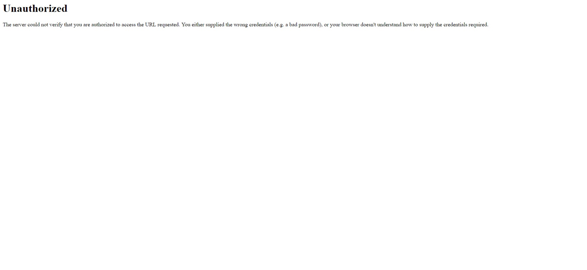

      Error unauthorized access

.. raw:: latex

    \newpage

