Parts Implemented by Görkem Toppeker
====================================
Game Friend Finding, ITU Activities, Sport Activities, Club Activities pages are created by Görkem Toppeker. Game Friend Finding page targets the ITU members that want to play different type of games and searching game friends for that aim. ITU Activities page aims to publish information about all the activities that held by ITU. Sport Activities page targets ITU members who want to know about near sport events and details about them. Club Activities page aims to share information about the activities that held by ITU Student Clubs.

All of these pages contain a table that lists the previously added entries. The entries can be easily sorted by clicking the arrow buttons above the related column as decreasing or increasing order.

.. raw:: latex

    \newpage
	
Game Friend Finding
-------------------

Most of the University students play video games, table games or sport games to relax and spend their leisure time. However, it is not easy to find congenial playmates, especially in the busy campus life. Therefore, students who are looking for playmates could post a message in this section that could be seen by others. In this way, they can easily find some playmates and this would help students in building new friendships and socialization.

In this page users can supply information about new Game Friend Finding entries and publish these announcements to all the website users.
 
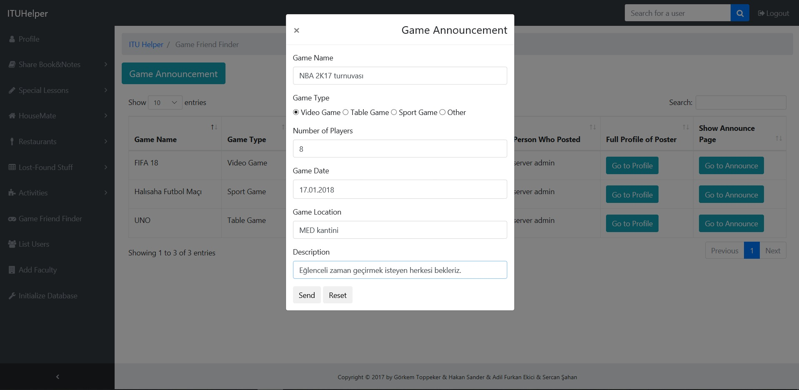

      Form to add new entry to Game Friend Finding Page

.. raw:: latex

    \newpage
	
In this page users can see all the previously added Game Announcements and go to profile page of person who posted that announcement via "Go to Profile" button, and detailed information of announcement can be reached via "Go to Announce" button.
 
.. figure:: images/gorkem/game-2.jpg
      :scale: 30 %
      :alt: game friend finding main page

      Page that lists all the previously added announcements
	  

In the details page, details of announcement is displayed additionally. Also, users can delete or update only their own entries except admin user. Other users cannot see "Update" and "Delete" buttons.
 
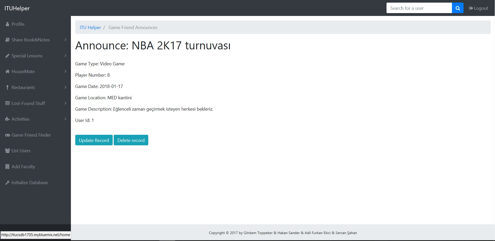

      Page that consists of details of announcements	  
	  
.. raw:: latex

    \newpage

If user clicks to "Update" button, a form, similar to form to add new entry, is displayed. If user want to update some information, all they need to do is entering new information to corresponding place.
 
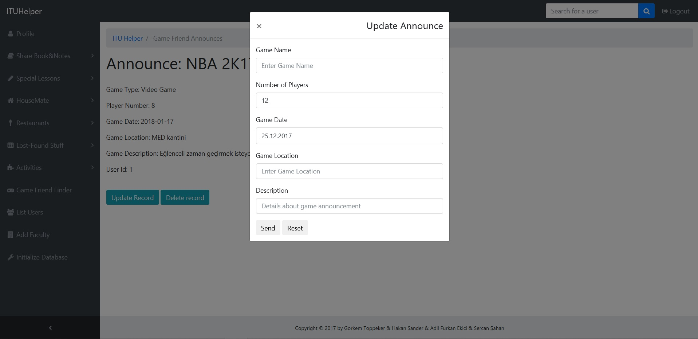

      Form to update existing record informations
	  
	  
If users clicks to "Delete" button, a confirmation dialog is displayed. If they also click to "Delete" button in this dialog, their entry will be deleted and will no longer be displayed.
 
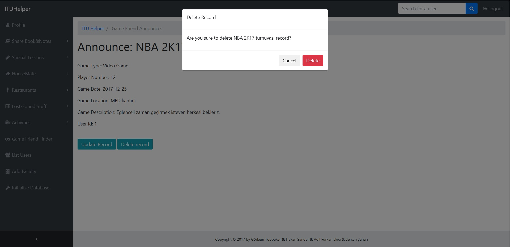

      Delete Confirmation message when clicked to "Delete" button 

	
.. raw:: latex

    \newpage
	
Student Club Activities
-----------------------

There are many activities every week that held by Student Clubs in ITU. In this page, users can search for these club activities and learn detailed information about them. The members of Student Clubs can also publish new announcements about coming club activities.

In this page users can supply information about new Student Club entries and publish these announcements to all the website users.
 
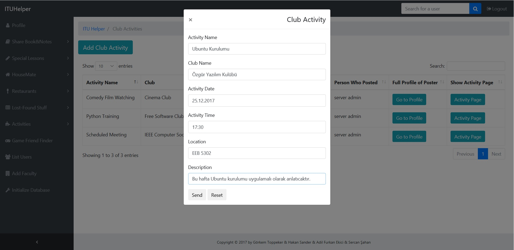

      Form to add new entry to Student Club Activities page
	  
	  
In this page users can see all the previously added Student Club Activities and go to profile page of person who posted that announcement via "Go to Profile" button, and detailed information of announcement can be reached via "Activity Page" button.
 
.. figure:: images/gorkem/stud-2.jpg
      :scale: 30 %
      :alt: Student Club Activities main page

      Page that lists all the previously added activities
	
.. raw:: latex

    \newpage
	
In the details page, details of announcement is displayed additionally. Also, users can delete or update only their own entries except admin user. Other users cannot see "Update" and "Delete" buttons.
 
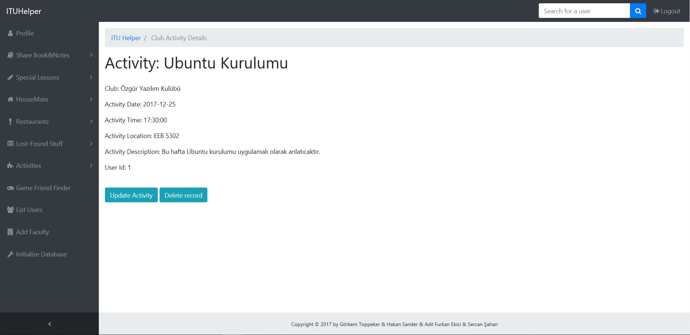

      Page that lists all the previously added announcements
	  
	
If user clicks to "Update" button, a form, similar to form to add new entry, is displayed. If user want to update some information, all they need to do is entering new information to corresponding place.
 
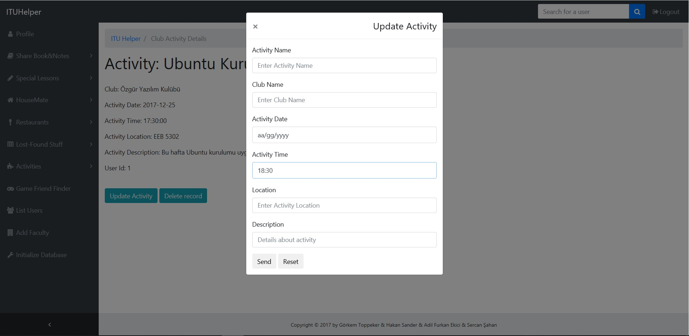

      Form to update existing record informations
	  
.. raw:: latex

    \newpage
	
If users clicks to "Delete" button, a confirmation dialog is displayed. If they also click to "Delete" button in this dialog, their entry will be deleted and will no longer be displayed.
 
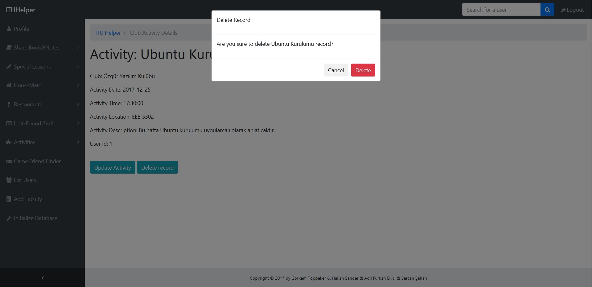

      Delete Confirmation message when clicked to "Delete" button

ITU Activities
--------------

ITU organizes many meetings, conferences and conversations weekly and monthly. In this page, users can reach the information about that activities and publish new announcements.
	  
In this page users can supply information about new ITU activity entries and publish these announcements to all the website users.
 
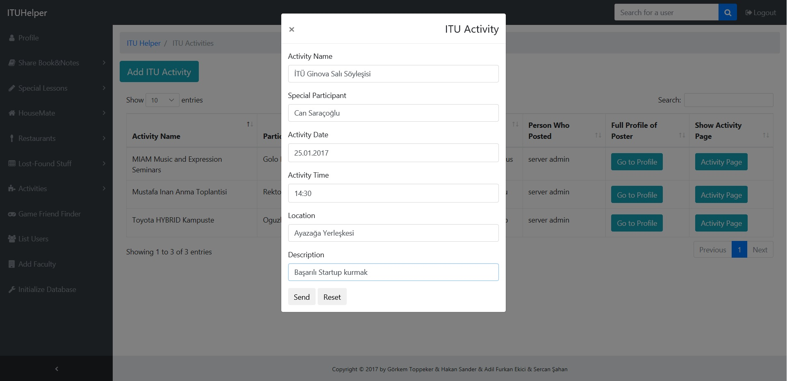

      Form to add new entry to ITU Activities page
	  
.. raw:: latex

    \newpage	  
	
In this page users can see all the previously added ITU Activities and go to profile page of person who posted that announcement via "Go to Profile" button, and detailed information of announcement can be reached via "Activity Page" button.
 
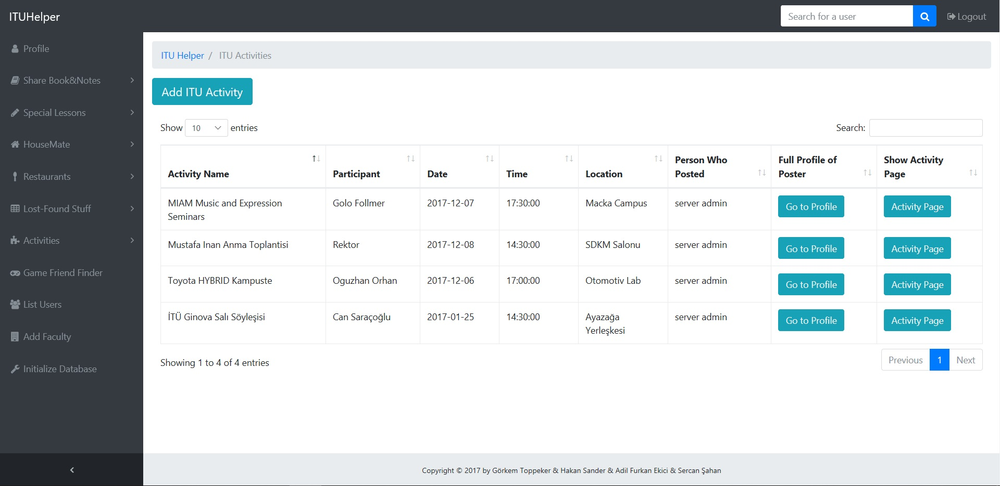

      Page that lists all the previously added activities
	  
	  
In the details page, details of announcement is displayed additionally. Also, users can delete or update only their own entries except admin user. Other users cannot see "Update" and "Delete" buttons.
 
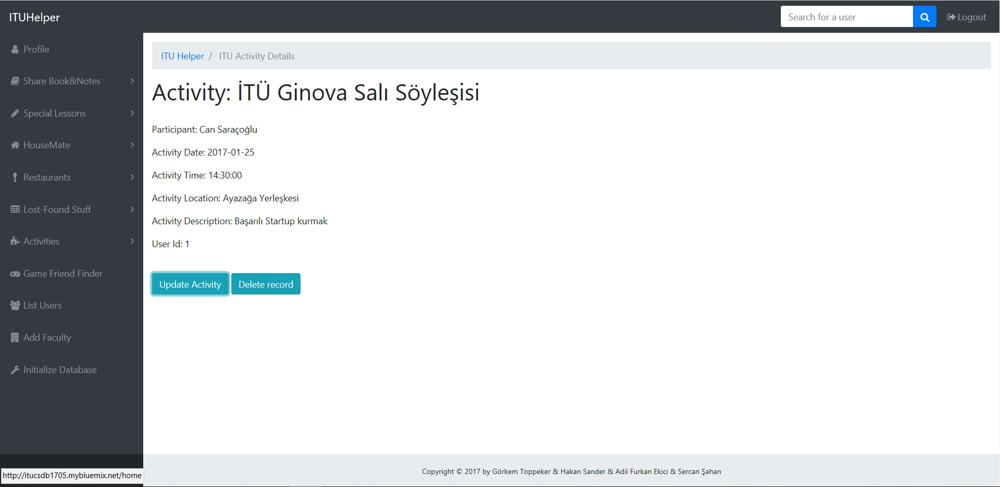

      Page that lists all the previously added announcements
	  
.. raw:: latex

    \newpage
	
If user clicks to "Update" button, a form, similar to form to add new entry, is displayed. If user want to update some information, all they need to do is entering new information to corresponding place.
 
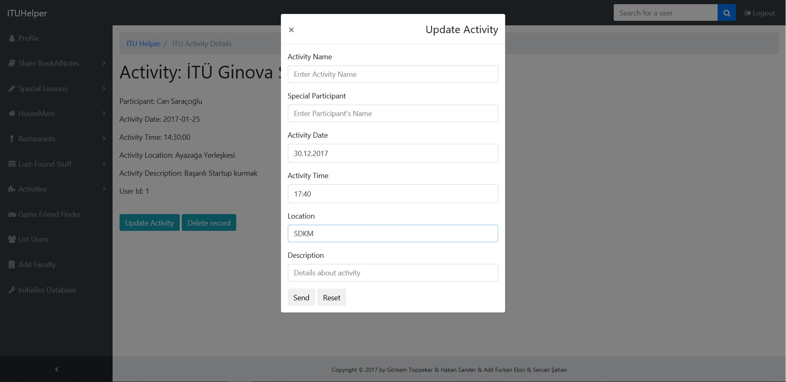

      Form to update existing record informations
	  
	
If users clicks to "Delete" button, a confirmation dialog is displayed. If they also click to "Delete" button in this dialog, their entry will be deleted and will no longer be displayed.
 
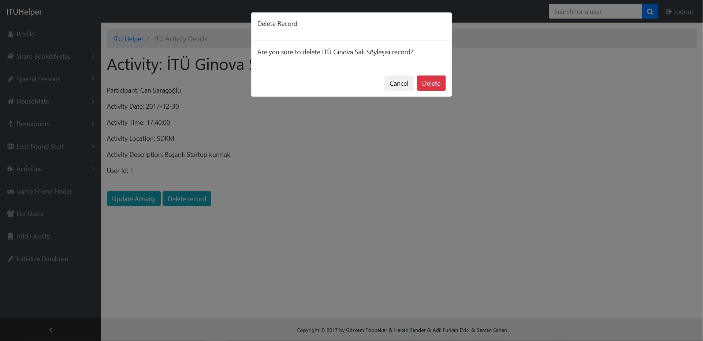

      Delete Confirmation message when clicked to "Delete" button

.. raw:: latex

    \newpage
	
Sport Activities
----------------

Sport is an important part of our lives and participating in sport events both as spectator and participant makes people happy. In this page, users can learn about coming sport events that they want to participate as spectators.
	  
In this page users can supply information about new Sport Activities and publish these announcements to all the website users.
 
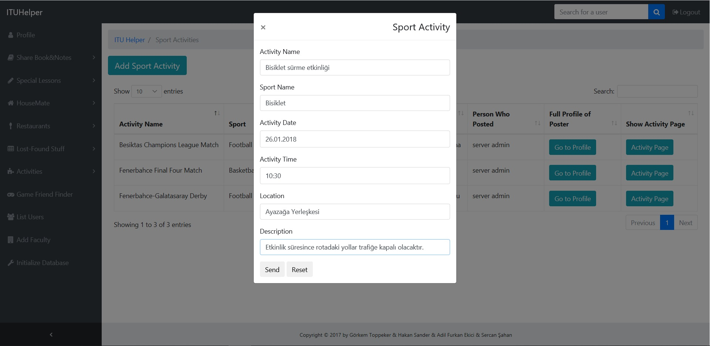

      Form to add new entry to Sport Activities page
	  	  
	
In this page users can see all the previously added Sport Activities and go to profile page of person who posted that announcement via "Go to Profile" button, and detailed information of announcement can be reached via "Activity Page" button.
 
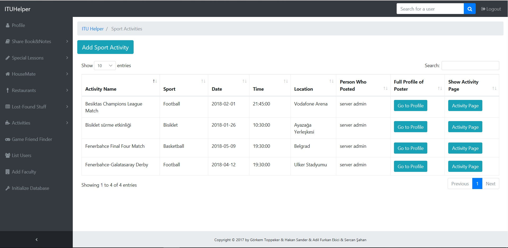

      Page that lists all the previously added activities
	  
.. raw:: latex

    \newpage	  
	  
In the details page, details of announcement is displayed additionally. Also, users can delete or update only their own entries except admin user. Other users cannot see "Update" and "Delete" buttons.
 
.. figure:: images/gorkem/sport-3.jpg
      :scale: 30 %
      :alt: Sport Activities details page

      Page that lists all the previously added announcements
	  
	
If user clicks to "Update" button, a form, similar to form to add new entry, is displayed. If user want to update some information, all they need to do is entering new information to corresponding place.
 
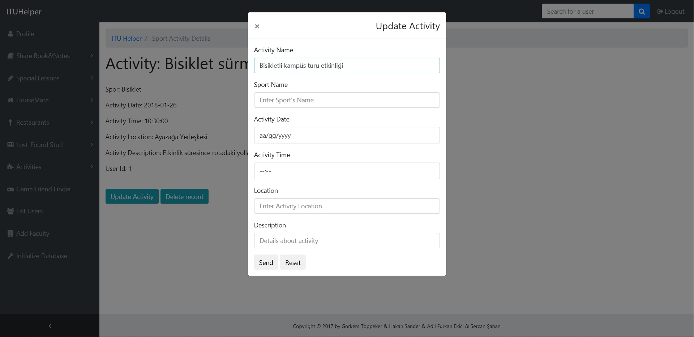

      Form to update existing record informations
	  
.. raw:: latex

    \newpage	  
	  	
If users clicks to "Delete" button, a confirmation dialog is displayed. If they also click to "Delete" button in this dialog, their entry will be deleted and will no longer be displayed.
 
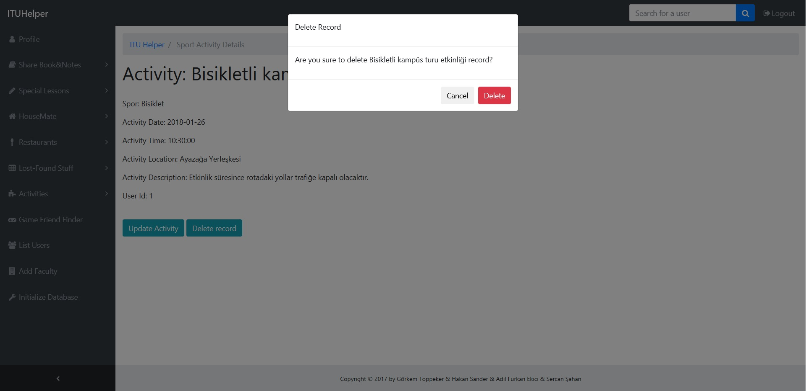

      Delete Confirmation message when clicked to "Delete" button

.. raw:: latex

    \newpage 