Parts Implemented by Adil Furkan Ekici
======================================
Sharing House, Searching House, Sharing Books and Sharing Lesson Notes pages are created by Adil Furkan Ekici. Sharing House and Searching House pages are targeted to ITU students who  need for shelter or need for housemate. Sharing Lesson Notes and Sharing Books pages are targeted to ITU students who have need for lesson book and lesson notes.

All of these pages display a table of entries to easily sort them. By default, tables in Sharing House and Searching House pages are sorted according to alphabetical order of "Location" column and tables in Sharing Lesson Notes and Sharing Books sorted according to alphabetical order of "Name of Lesson Notes&Books" column.

.. raw:: latex

    \newpage

Sharing House
-------------
There are students who searching housemate for own house.Owner of house create announcement with add modal form.

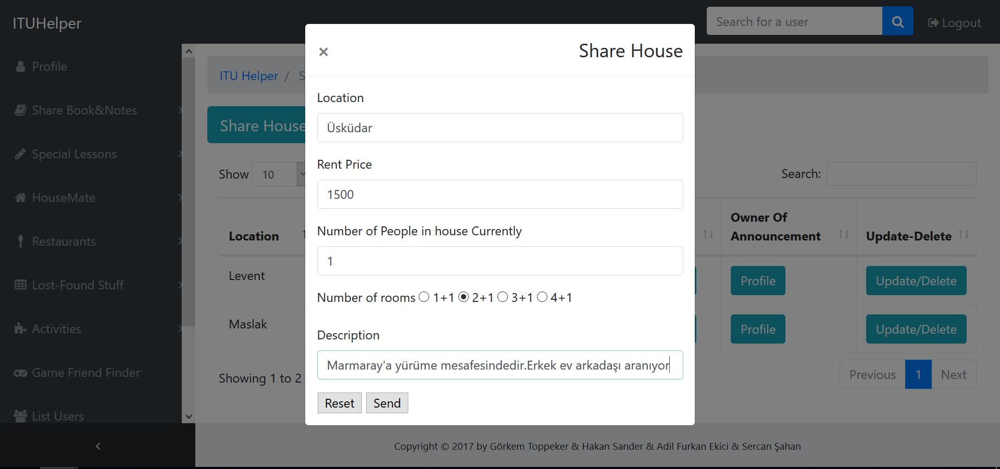

      Form to add new entry to Sharing House

.. raw:: latex

    \newpage

In this page people can go to profile page of person who posted announcement via "Profile" button, description of sharing house via "Description" button,and users can be reached via  "Update/Delete" button for delete,update and details.

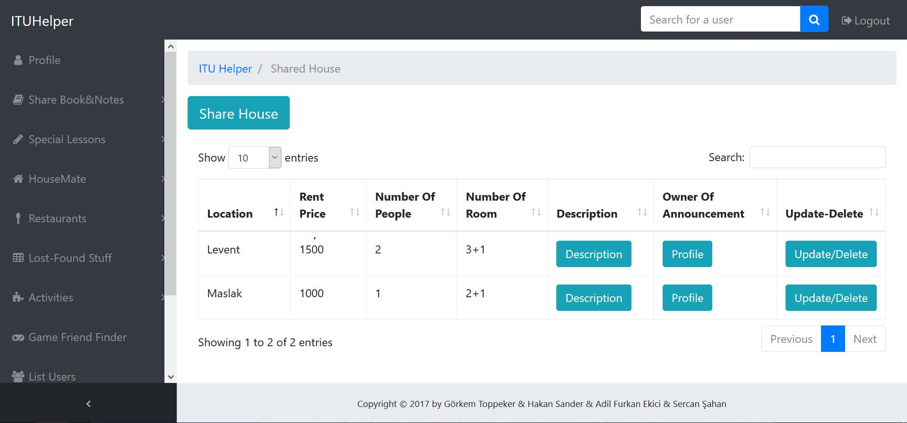

      List of Sharing House Announcements

In the details page, details of announcement is displayed additionally. Also, users can delete or update only their own entries. Other users cannot see "Update" and "Delete" buttons.

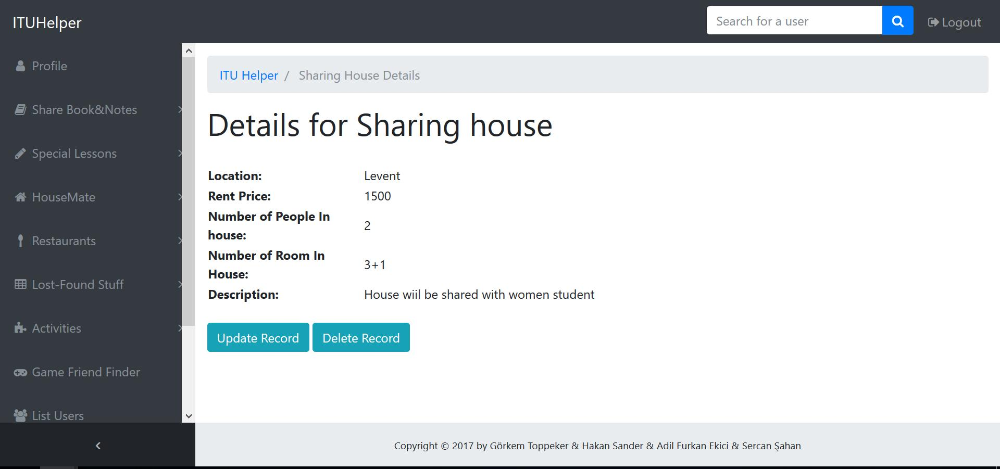

      Detail of Sharing House Announcement

.. raw:: latex

    \newpage

If user clicks to "Update" button, a form, similar to form to add new entry, is displayed. If user want to update some information, all they need to do is entering new information to corresponding place.

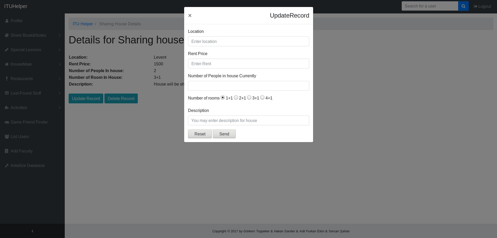

      Update Form of Sharing House Announcement

If users clicks to "Delete" button, a confirmation dialog is displayed. If they also click to "Delete" button in this dialog, their entry will be deleted and will no longer be displayed.

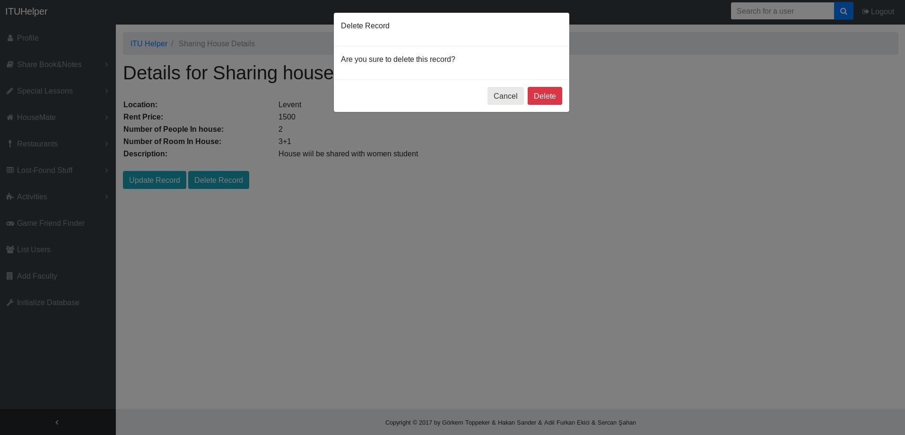

      Delete Dialog of Sharing House Announcement

Searching House
---------------

There are students who searching house .Owner of house create announcement for searching house criteria.

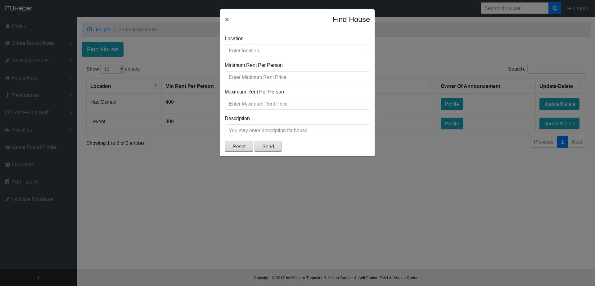

      Form to add new entry to Searching House

.. raw:: latex

    \newpage

In this page people can go to profile page of person who posted announcement via "Profile" button, description of sharing house via "Description" button,and users can be reached via  "Update/Delete" button for delete,update and details.

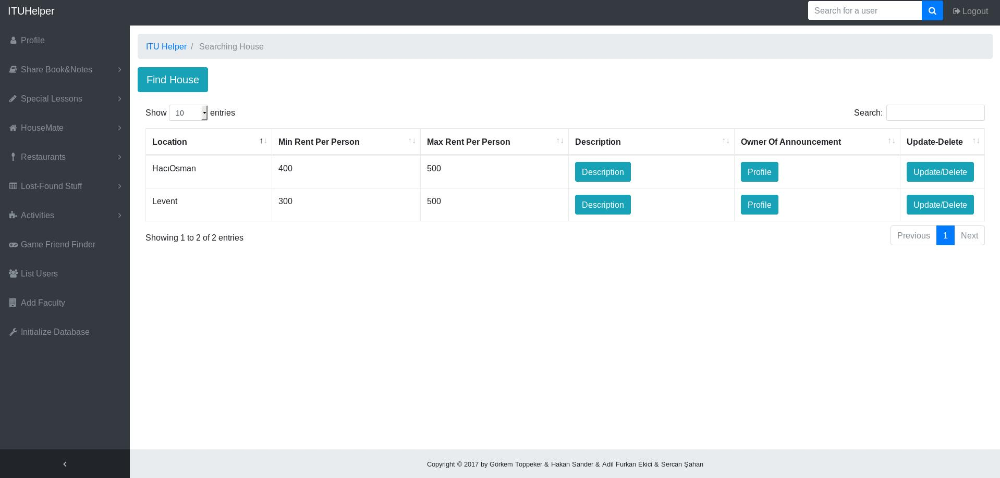

      List of Searching House Announcements

In the details page, details of announcement is displayed additionally. Also, users can delete or update only their own entries. Other users cannot see "Update" and "Delete" buttons.

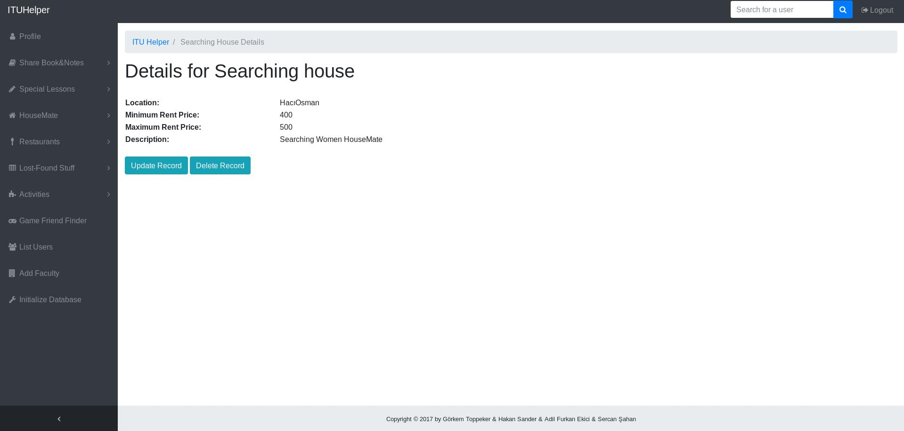

      Detail of Searching House Announcement
.. raw:: latex

    \newpage

If user clicks to "Update" button, a form, similar to form to add new entry, is displayed. If user want to update some information, all they need to do is entering new information to corresponding place.

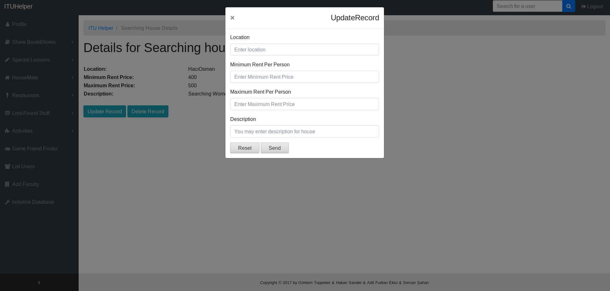

      Update Form of Searching House Announcement

If users clicks to "Delete" button, a confirmation dialog is displayed. If they also click to "Delete" button in this dialog, their entry will be deleted and will no longer be displayed.

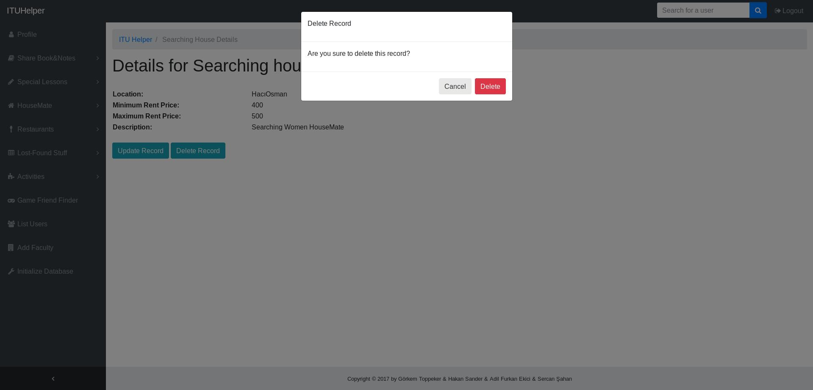

      Delete Dialog of Searching House Announcement

Sharing Books
-------------

There are students who sharing books .Owner of book create announcement for sharing books.

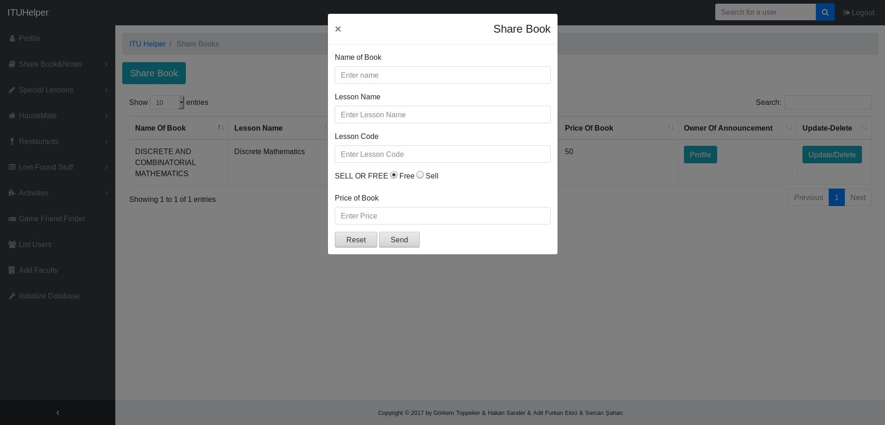

      Form to add new entry to Sharing Book

.. raw:: latex

    \newpage

In this page people can go to profile page of person who posted announcement via "Profile" button, and users can be reached via  "Update/Delete" button for delete,update and details.

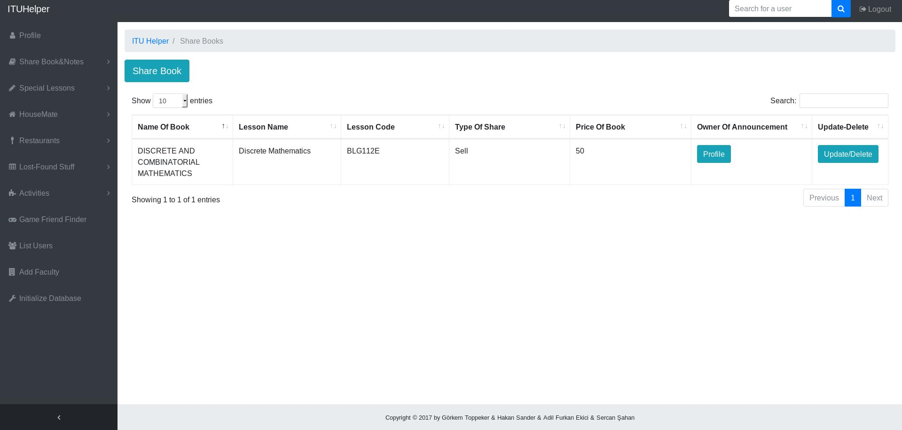

      List of Sharing Book Announcements

In the details page, details of announcement is displayed additionally. Also, users can delete or update only their own entries. Other users cannot see "Update" and "Delete" buttons.

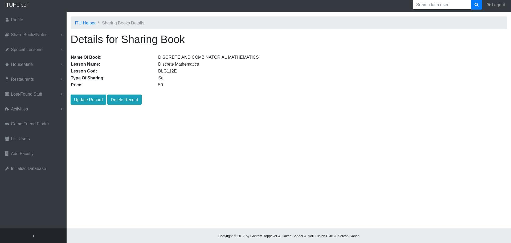

      Detail of Sharing Book Announcement

.. raw:: latex

    \newpage

If user clicks to "Update" button, a form, similar to form to add new entry, is displayed. If user want to update some information, all they need to do is entering new information to corresponding place.

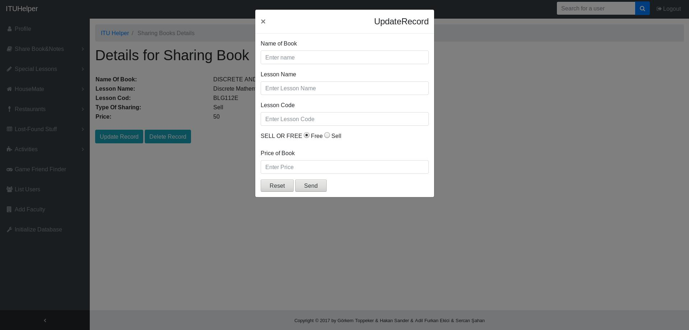

      Update Form of Sharing Book Announcement

If users clicks to "Delete" button, a confirmation dialog is displayed. If they also click to "Delete" button in this dialog, their entry will be deleted and will no longer be displayed.

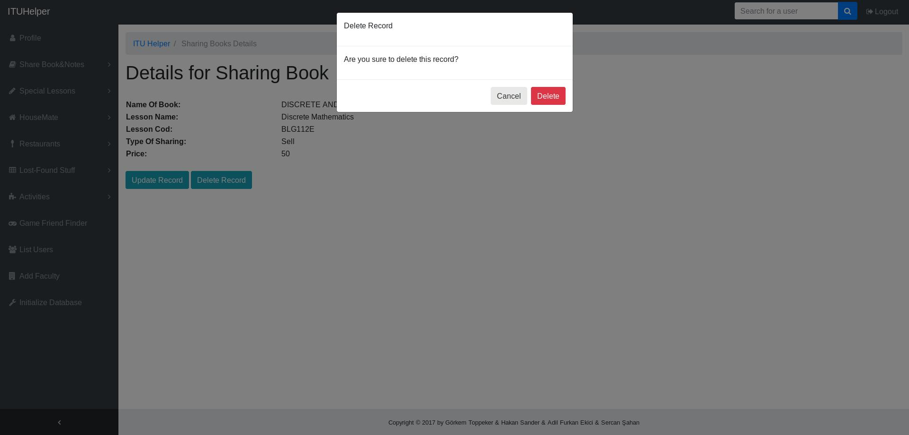

      Delete Dialog of Sharing Book Announcement

Sharing Lesson Notes
--------------------

There are students who sharing lesson notes .Owner of lesson notes create announcement for sharing lesson notes.

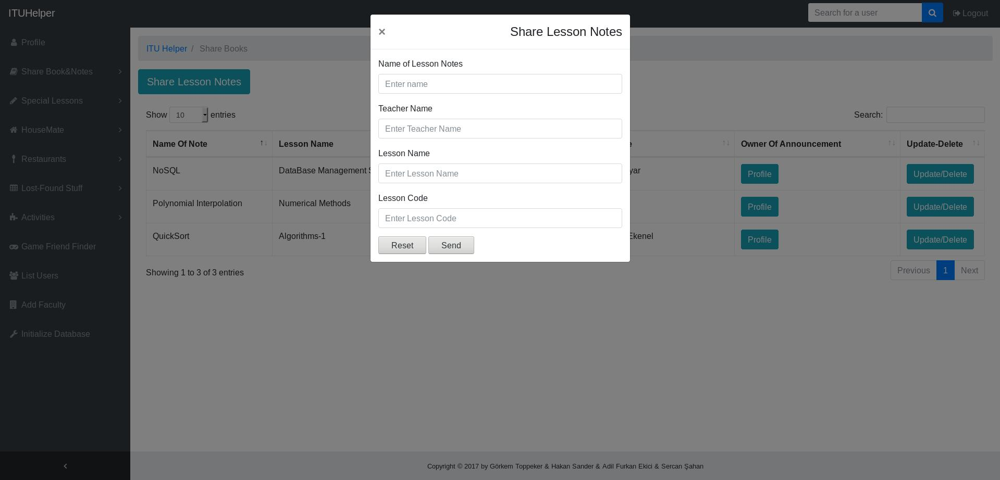

      Form to add new entry to Lesson Notes

.. raw:: latex

    \newpage

In this page people can go to profile page of person who posted announcement via "Profile" button, and users can be reached via  "Update/Delete" button for delete,update and details.

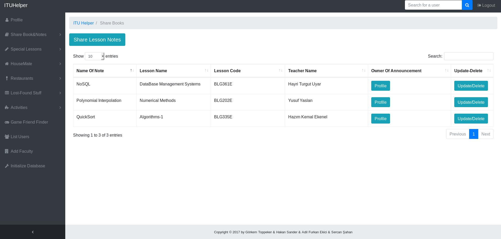

      List of Lesson Notes Announcements

In the details page, details of announcement is displayed additionally. Also, users can delete or update only their own entries. Other users cannot see "Update" and "Delete" buttons.

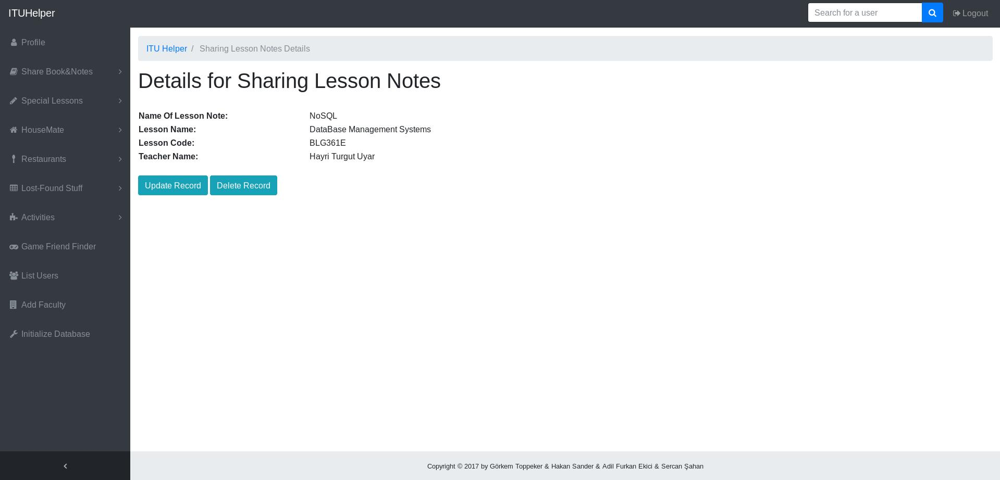

      Detail of Lesson Notes Announcement

.. raw:: latex

    \newpage

If user clicks to "Update" button, a form, similar to form to add new entry, is displayed. If user want to update some information, all they need to do is entering new information to corresponding place.

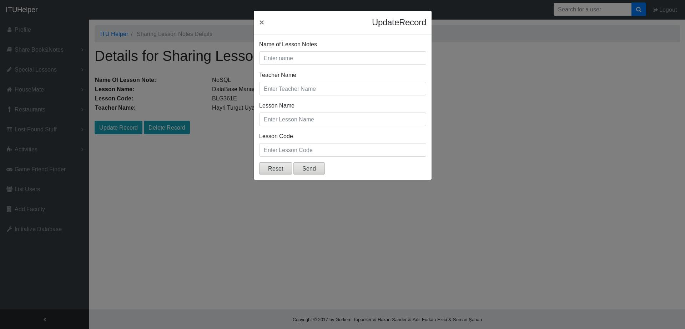

      Update Form of Lesson Notes Announcement

If users clicks to "Delete" button, a confirmation dialog is displayed. If they also click to "Delete" button in this dialog, their entry will be deleted and will no longer be displayed.

      Delete Dialog of Lesson Notes Announcement

.. raw:: latex

    \newpage

