Parts Implemented by Sercan Şahan
=================================
Special Tutors, Special Students, Lost Stuff and Found Stuff pages are created by Sercan Şahan.

Special Students and Special Tutors pages are targeted to students who want to help each other in lessons.

Lost Stuff and Found Stuff pages are targeted to people who lost their properties.

All of these pages display a table of entries to easily sort them.

By default, tables in Special Tutors and Special Students pages are sorted according to alphabetical order of "Subject" column and tables in Lost Stuff and Found Stuff sorted according to alphabetical order of "Description" column.

.. raw:: latex

    \newpage

Special Tutors
--------------
There are students who are relatively better than other students at some subjects. Sometimes, other students need one of their peers to understand some subjects.

Students who seek one of their peers to tutor them can visit this page to find a suitable tutor or students who can tutor other students can create new entry for others to find them.

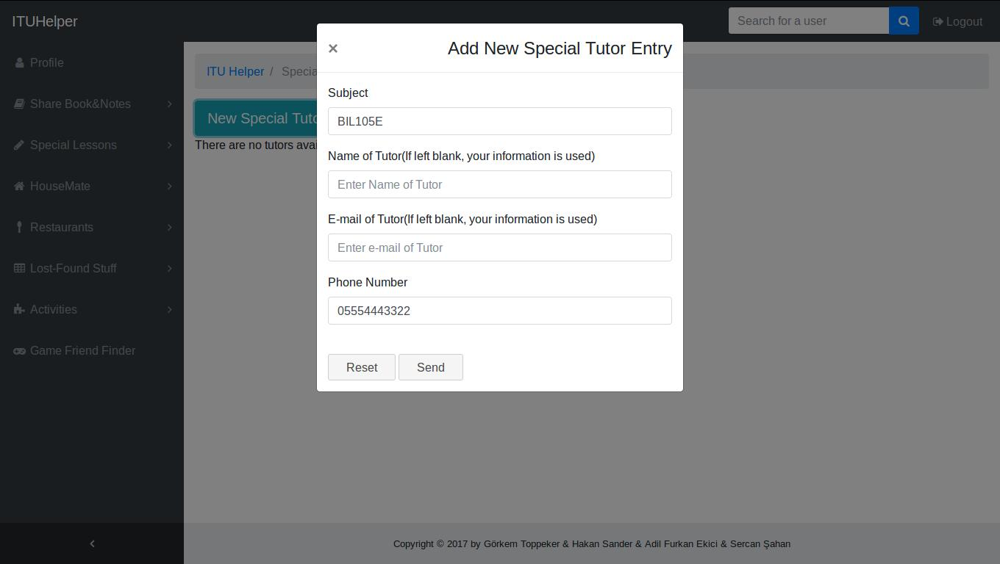

      Form to add new entry to Special Tutors

In this page people can go to profile page of person who posted announcement via "Profile" button, and contact information of person who wants to tutor can be reached via  "Details" button.

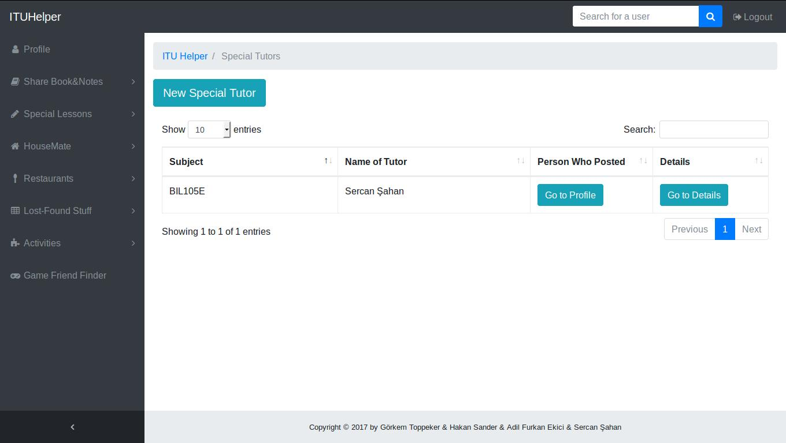

      List of Special Tutors

.. raw:: latex

    \newpage

In the details page, contact information of tutor is displayed additionally. So, users who are for looking tutor's contact info can get it from here. Also, users can delete or update only their own entries.

Other users cannot see "Update" and "Delete" buttons.

.. figure:: images/sercan/specialtutorsdetails.jpg
      :scale: 30 %
      :alt: special tutor detail page

      Detail of Special Tutors

If user clicks to "Update" button, a form, similar to form to add new entry, is displayed. If user want to update some information, all they need to do is entering new information to corresponding place.

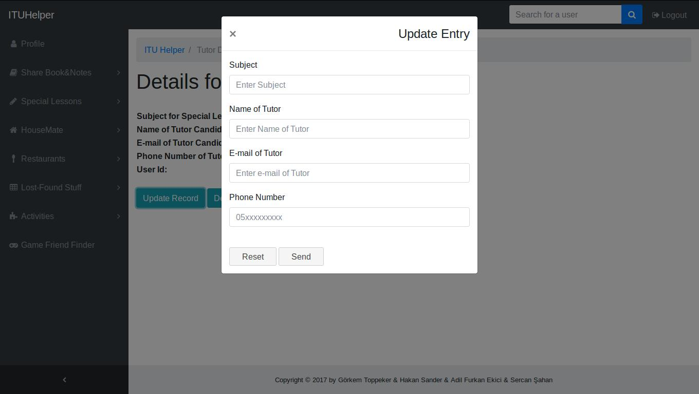

      Update Form of Special Tutors

.. raw:: latex

    \newpage

If users clicks to "Delete" button, a confirmation dialog is displayed. If they also click to "Delete" button in this dialog, their entry will be deleted and will no longer be displayed.

      Delete Dialog of Special Tutors

Special Students
----------------
There are also students who need one of their peers to tutor them so that they can understand some subjects since their friends can explain subjects in a more understandable way.

Students who seek a group of students can visit this page to find them or students who seek one of their peers to tutor them can create new entry for others to find them and tutor them.

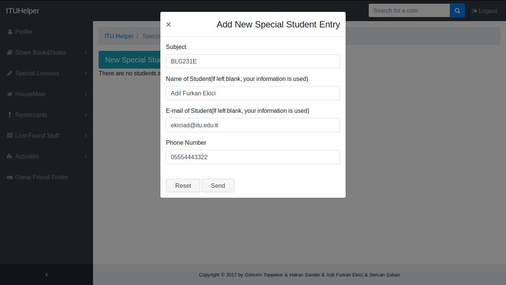

      Form to add new entry to Special Students

.. raw:: latex

    \newpage

In this page people can go to profile page of person who posted announcement via "Profile" button, and contact information of person who wants to be tutored can be reached via  "Details" button.

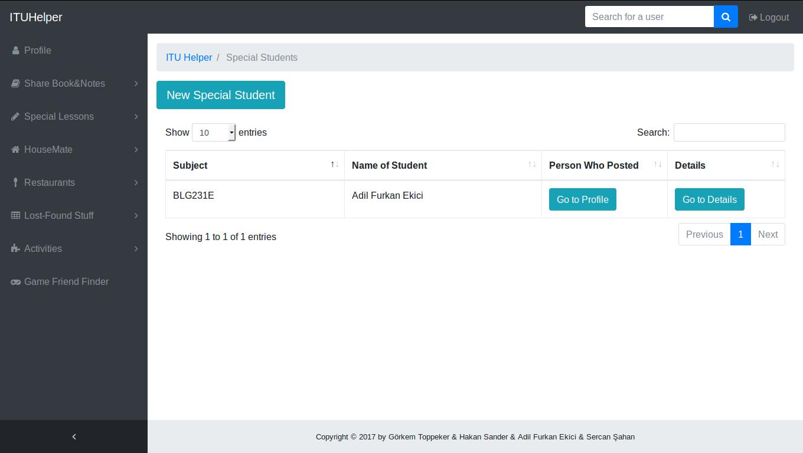

      List of Special Students

In the details page, similar to Special Tutors' details page, contact information of tutor is displayed additionally. So, users who are looking for tutor's contact info can get it from here.

Also, users can delete or update only their own entries. Other users cannot see "Update" and "Delete" buttons.

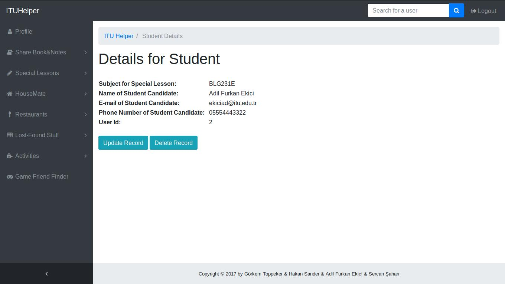

      Detail of Special Students

.. raw:: latex

    \newpage

Also similar to Special Tutors' Update form, if user clicks to "Update" button, a form, similar to form to add new entry, is displayed.

If user want to update some information, all they need to do is entering new information to corresponding place.

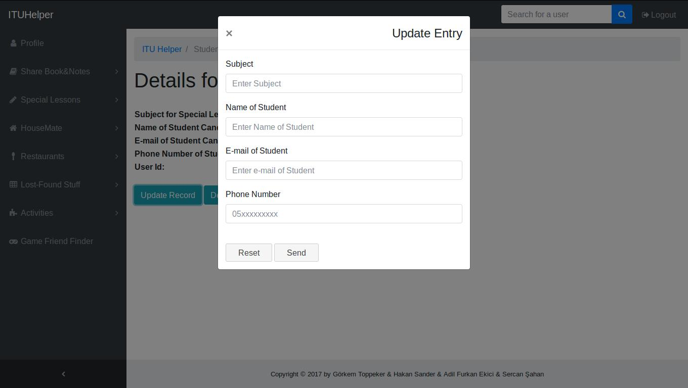

      Update Form of Special Students

Just like Special Tutors' Delete confirmation, if users clicks to "Delete" button, a confirmation dialog is displayed.

If they also click to "Delete" button in this dialog, their entry will be deleted and will no longer be displayed.

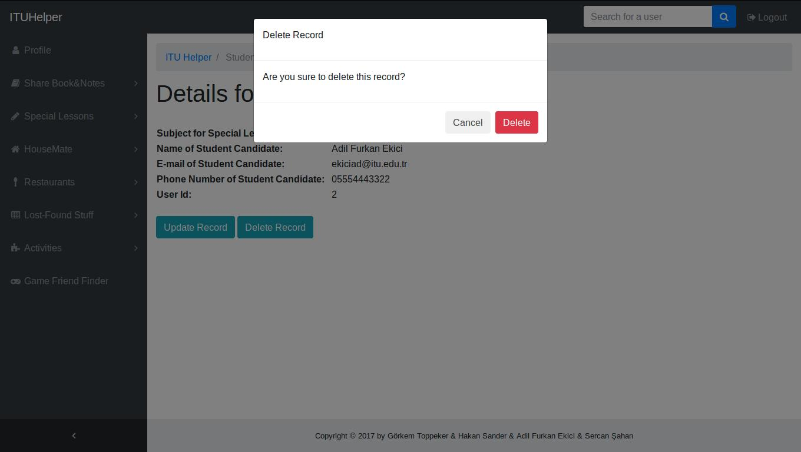

      Delete Dialog of Special Students

.. raw:: latex

    \newpage

Lost Stuff
----------
Sometimes, people lose their properties without realizing it. These people can enter this page and create entries to announce it and, where and when they have lost it.

If a person finds it, they can look at this page to check if a person posted an announcement. After that, they can contact and owner can get their property back from person who found it.

.. figure:: images/sercan/loststuffadd.jpg
      :scale: 30 %
      :alt: lost stuff add page

      Adding new entry to Lost Stuff

In this page people can go to profile page of person who posted announcement via "Profile" button, and contact information of person who lost something can be reached via "Details" button.

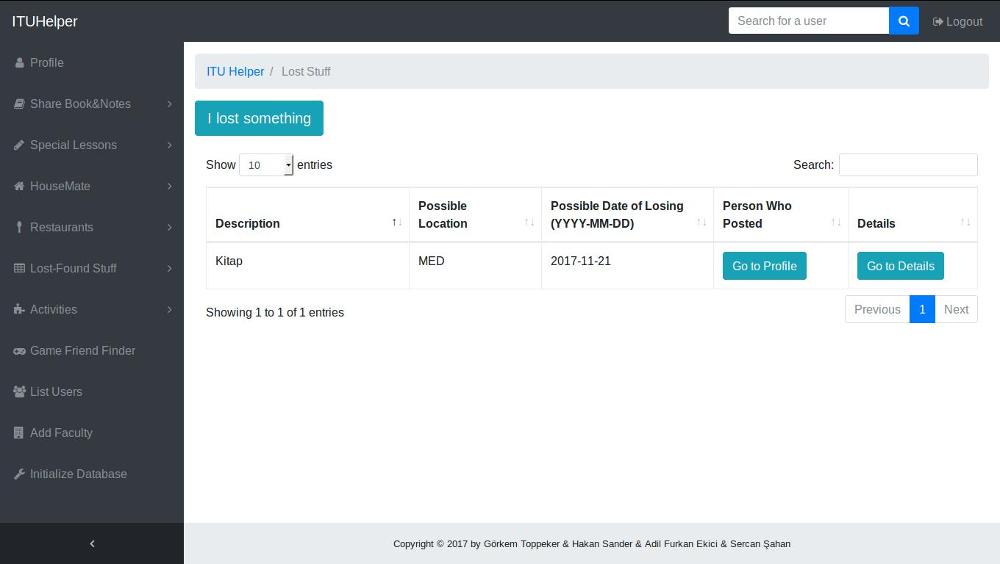

      List of Lost Stuff

.. raw:: latex

    \newpage

In this page, details of contact information of owner is displayed so that, if a person checks this page, they can reach owner via phone or e-mail.

      Details of Lost Stuff

If user clicks to "Update" button, a form, similar to form to add new entry, is displayed.

If user want to update some information, all they need to do is entering new information to corresponding place and clicking "Send" button.

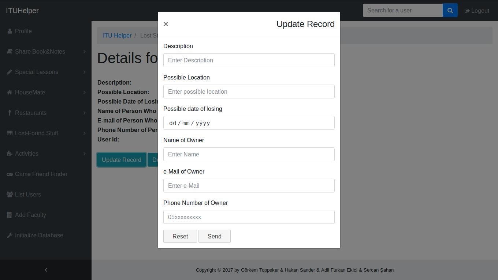

      Update Form of Lost Stuff

.. raw:: latex

    \newpage

If users clicks to "Delete" button, a confirmation dialog is displayed. If they also click to "Delete" button in this dialog, their entry will be deleted and will no longer be displayed.

      Delete Dialog of Lost Stuff

Found Stuff
-----------
There are students who find some properties without their owner in sight. These people can announce they found something and, where and when they found it.

People who lost something can visit this page to check if their property is found, and if a person announced that they have found it, they can contact. So, owner can get their property back.

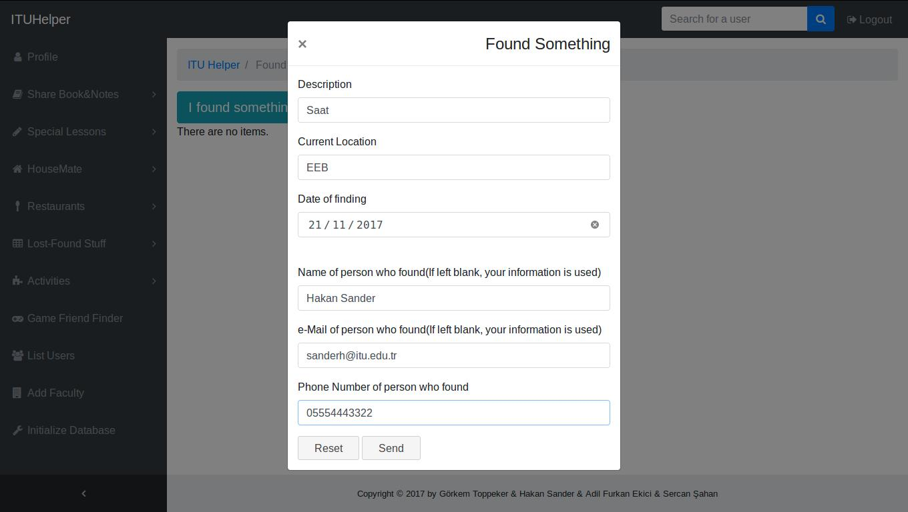

      Adding new entry to Found Stuff

.. raw:: latex

    \newpage

In this page people can go to profile page of person who posted announcement via "Profile" button, and contact information of person who found something can be reached via  "Details" button.

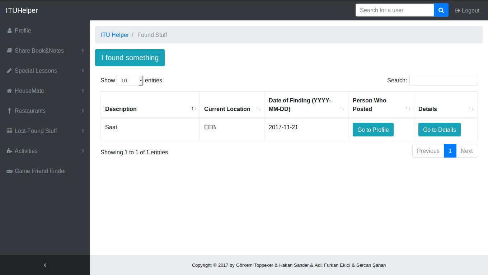

      List of Found Stuff

In this page, details of contact information of person who found something is displayed so that, if a person checks this page, they can reach that person via phone or e-mail.

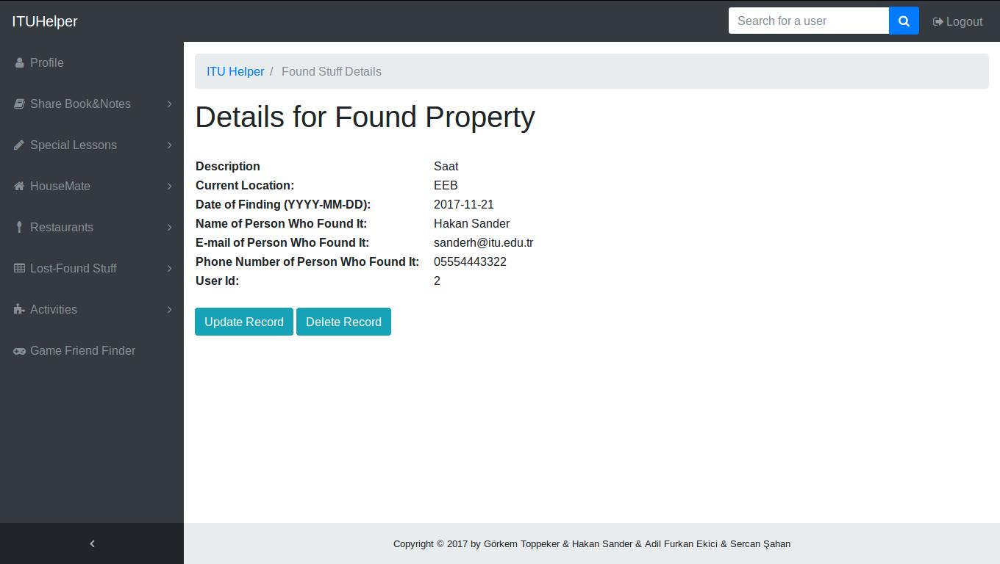

      Details of Found Stuff

.. raw:: latex

    \newpage

Just like Lost Stuff's update form, if user clicks to "Update" button, a form, similar to form to add new entry, is displayed.

If user want to update some information, all they need to do is entering new information to corresponding place and clicking "Send" button.

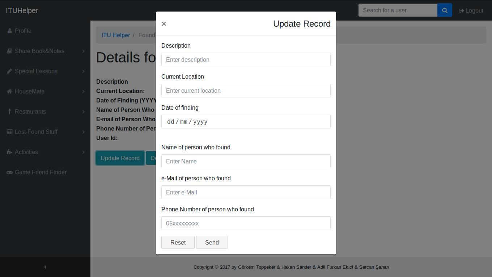

      Update Form of Found Stuff

If users clicks to "Delete" button, a confirmation dialog, similar to confirmation dialog in Lost Stuff's Delete confirmation, is displayed.

If they also click to "Delete" button in this dialog, their entry will be deleted and will no longer be displayed.

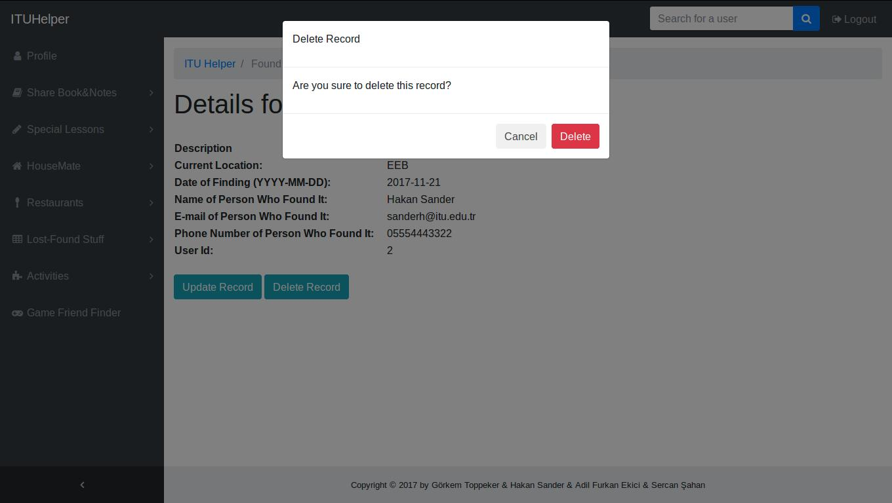

      Delete Dialog of Found Stuff